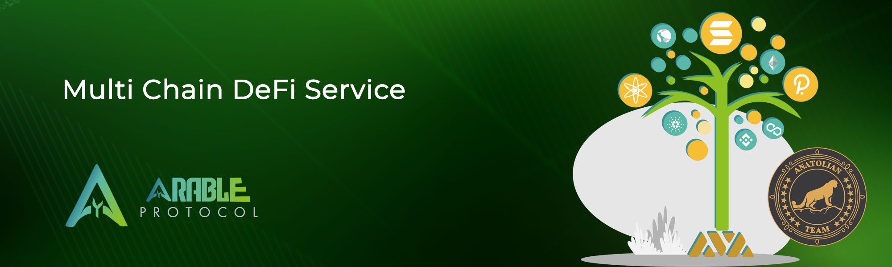

# Arable Protocol



## Links
 ✔️ [Website](https://www.arable.finance/) |
 ✔️ [Blockchain Explorer](https://cosmos.anatolianteam.com/arable) |
 ✔️ [Doküman](https://about.arable.finance/) |
 ✔️ [GitHub](https://github.com/ArableProtocol) |
 ✔️ [Discord](http://discord.gg/arable)

## Stake with Us ♻️
You can stake using auto-compound [here](https://restake.app/acrechain/acrevaloper10uc3h2348v9dxa7evkjhep8xxtsd8f7de3xg5t) without paying any fees.

## Requirements

| Components | Minimum | **Recommended** |
| ------------ | ------------ | ------------ |
| CPU |	4 | 8 |
| RAM	| 16 GB | 31 GB |
| Storage	| 500 GB SSD | 1 TB SSD | 

## Network Info 

* Network Chain ID: acre_9052-1
* Binary: acred
* Denom: aacre
* Çalışma dizini: .acred

## Public Services
* **RPC:**
    * https://rpc.acre.nodestake.top/
    * https://rpc.acrescan.com/
    * https://rpc-acre.synergynodes.com/
    * https://rpc-acrechain.nodeist.net/
    * https://jsonrpc.point.nodestake.top/
    * https://api.acre.nodestake.top/
* **API:**
    * https://rest.acrescan.com/
    * https://lcd-acre.synergynodes.com/
    * https://api-acrechain.nodeist.net/
* **Explorer:** https://cosmos.anatolianteam.com/arable

## Peering (Coming Soon)
You can use peer for fast connection or state sync 
```shell
peers="COMING SOON"
sed -i.bak -e "s/^persistent_peers *=.*/persistent_peers = \"$peers\"/" $HOME/.acred/config/config.toml
```
The address book is updated once three hour. You can use it for quick launch.
```shell
wget -O $HOME/.acred/config/addrbook.json "https://testnet.anatolianteam.com/artela/addrbook.json"
```-O $HOME/.acred/config/addrbook.json "https://testnet.anatolianteam.com/artela/addrbook.json"
```

```mdx-code-block
import DocCardList from '@theme/DocCardList';

<DocCardList />
```
