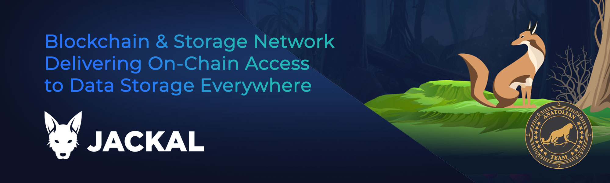

# Jackal Protocol



## Links
 ✔️ [Website](https://www.jackalprotocol.com/) |
 ✔️ [Blockchain Explorer](https://cosmos.anatolianteam.com/jackal) |
 ✔️ [Docs](https://docs.jackalprotocol.com/) |
 ✔️ [GitHub](https://github.com/jackallabs/) |
 ✔️ [Discord](https://discord.com/invite/5GKym3p6rj)

## Stake with Us ♻️
You can stake using auto-compound [here](https://restake.app/acrechain/jklvaloper1qhm6hucmshaz6s3mdyl8jje9ryk7t5uxgxy6w8) without paying any fees.

## Requirements

| Components | Minimum | **Recommended** |
| ------------ | ------------ | ------------ |
| CPU |	4 | 8 |
| RAM	| 16 GB | 32 GB |
| Storage	| 500 GB SSD | 1 TB SSD | 

## Network Info 

* Network Chain ID: jackal-1
* Binary: canined
* Denom: ujkl
* Working directory: .canine

## Public Services
* **RPC:**
    * https://rpc.jackalprotocol.com
    * https://jackal-rpc.polkachu.com
    * https://rpc.jackal.nodestake.top
* **API:**
    * https://api.jackalprotocol.com
    * https://jackal-api.polkachu.com
    * https://api.jackal.nodestake.top
* **Explorer:** https://cosmos.anatolianteam.com/jackal

## Peering (Coming Soon)
You can use peer for fast connection or state sync 
```shell
peers="COMING SOON"
sed -i.bak -e "s/^persistent_peers *=.*/persistent_peers = \"$peers\"/" $HOME/.canine/config/config.toml
```
The address book is updated once three hour. You can use it for quick launch.
```shell
wget -O $HOME/.acred/config/addrbook.json "https://mainnet.anatolianteam.com/jackal/genesis.json"
wget -O $HOME/.acred/config/addrbook.json "https://mainnet.anatolianteam.com/jackal/addrbook.json"
```

```mdx-code-block
import DocCardList from '@theme/DocCardList';

<DocCardList />
```
