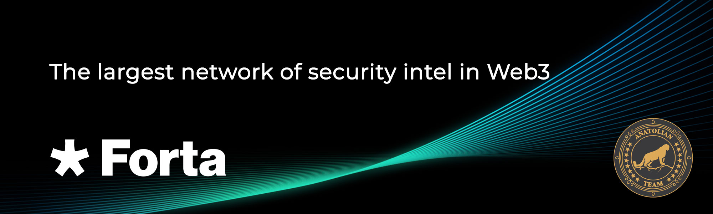

# Forta



## Links
 ✔️ [Website](https://www.forta.org/) |
 ✔️ [App](https://app.forta.network/) |
 ✔️ [Docs](https://docs.forta.network/) |
 ✔️ [GitHub](https://github.com/forta-network) |
 ✔️ [Discord](https://discord.gg/nbPQXRepWV)

## Stake with Us ♻️
You can stake using [restake](https://restake.app/stride/stridevaloper1ehmnl9jdf2hnj78va888gtpz9e3d4g4ll3wthh), [Keplr](https://wallet.keplr.app/?tab=staking&modal=validator&chain=stride-1&validator_address=stridevaloper1ehmnl9jdf2hnj78va888gtpz9e3d4g4ll3wthh) or [Explorer](https://cosmos.anatolianteam.com/stride/staking/stridevaloper1ehmnl9jdf2hnj78va888gtpz9e3d4g4ll3wthh).

## Requirements

| Components | Minimum | **Recommended** |
| ------------ | ------------ | ------------ |
| CPU |	4 | 8 |
| RAM	| 16 GB | 32 GB |
| Storage	| 500 GB SSD | 1 TB SSD | 

```mdx-code-block
import DocCardList from '@theme/DocCardList';

<DocCardList />
```
