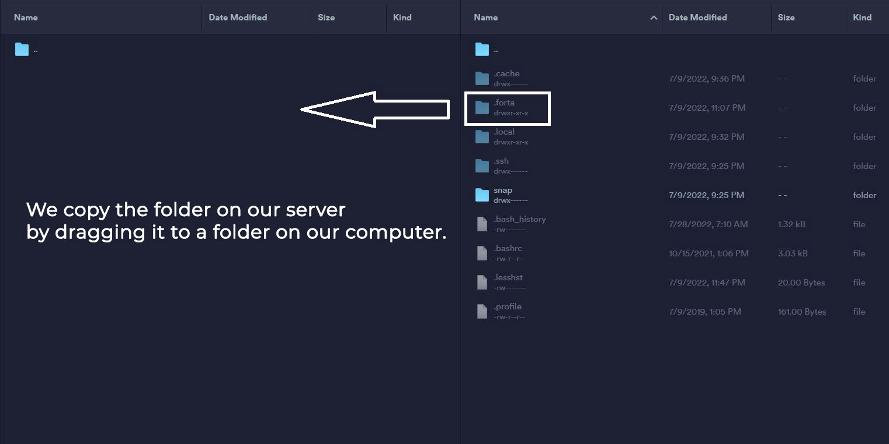
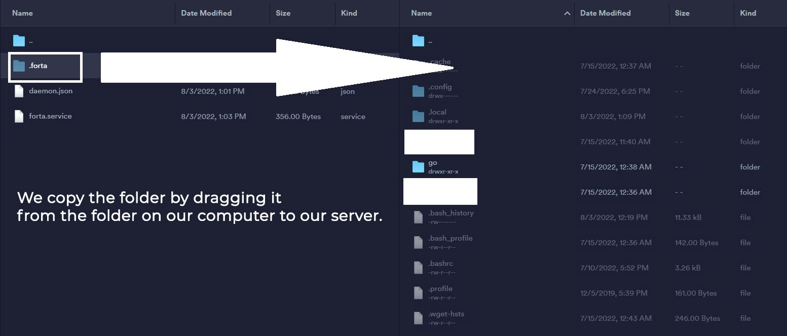
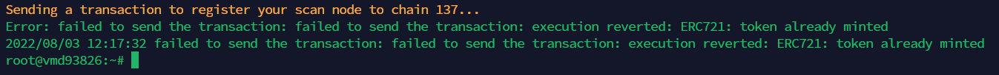
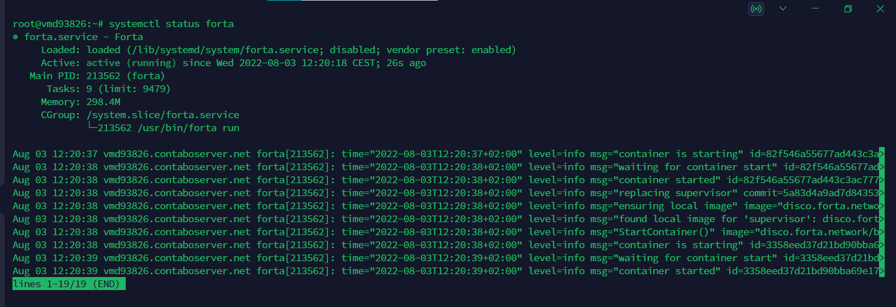

import Tabs from '@theme/Tabs';
import TabItem from '@theme/TabItem';
# Forta Node Migration

## Copying the .forta Folder
First of all, we need to install winscp, termius etc. on our server. We connect with a program and copy the .forta folder in the root directory to our computer.


Bu adımı gerçekleştirdikten sonra yeni sunucumuza kurulum yapıyoruz.

## Updating the System
```shell
sudo apt update && sudo apt upgrade -y
```

## Installing the Necessary Libraries
```shell
sudo apt install ca-certificates curl gnupg lsb-release git htop liblz4-tool screen -y < "/dev/null"
```
## Installing Docker
```shell
curl -fsSL https://download.docker.com/linux/ubuntu/gpg | sudo gpg --dearmor -o /usr/share/keyrings/docker-archive-keyring.gpg
echo "deb [arch=$(dpkg --print-architecture) signed-by=/usr/share/keyrings/docker-archive-keyring.gpg] https://download.docker.com/linux/ubuntu $(lsb_release -cs) stable" | sudo tee /etc/apt/sources.list.d/docker.list > /dev/null
apt-get update
apt-get install docker-ce docker-ce-cli containerd.io
docker version
```
If you get an error or 'Abort' output when you enter the above codes all at once, enter the codes one by one.

## Creating a Docker Daemon File
```shell
tee /etc/docker/daemon.json > /dev/null <<EOF
{
   "default-address-pools": [
        {
            "base":"172.17.0.0/12",
            "size":16
        },
        {
            "base":"192.168.0.0/16",
            "size":20
        },
        {
            "base":"10.99.0.0/16",
            "size":24
        }
    ]
}
EOF
```

## Restarting Docker
```shell
systemctl restart docker
```

## Installing Forta
```shell
sudo curl https://dist.forta.network/pgp.public -o /usr/share/keyrings/forta-keyring.asc -s
echo 'deb [signed-by=/usr/share/keyrings/forta-keyring.asc] https://dist.forta.network/repositories/apt stable main' | sudo tee -a /etc/apt/sources.list.d/forta.list
apt-get update
apt-get install forta
```

## Moving .forta Folder to New Server
This time we copy the .forta folder we copied here to our new server.


## Checking the Configuration File
We open the `config.yml` file with the code below.
```shell
nano /root/.forta/config.yml
```
We check whether the file content is as follows. In the 'ALCHEMY_LINK' section, we also check whether your alchemy address starting with 'https' is correct. If the file content is not as follows, we delete the codes in the file, edit the code below and paste it into the file.

<Tabs>
<TabItem value="Polygon">

```
rm /root/.forta/config.yml
sudo tee /root/.forta/config.yml > /dev/null <<EOF
chainId: 137

scan:
  jsonRpc:
    url: ALCHEMY_LINK

trace:
  enabled: false
EOF
```

</TabItem>
<TabItem value="BSC">

```  
rm /root/.forta/config.yml
sudo tee /root/.forta/config.yml > /dev/null <<EOF
chainId: 56

scan:
  jsonRpc:
    url: ALCHEMY_LINK

trace:
  enabled: false
EOF
```

</TabItem>
<TabItem value="Ethereum">

``` 
rm /root/.forta/config.yml
sudo tee /root/.forta/config.yml > /dev/null <<EOF
chainId: 1

scan:
  jsonRpc:
    url: ALCHEMY_LINK

trace:
  enabled: false
EOF
```

</TabItem>
<TabItem value="Arbitrum">

```
rm /root/.forta/config.yml
sudo tee /root/.forta/config.yml > /dev/null <<EOF
chainId: 42161

scan:
  jsonRpc:
    url: ALCHEMY_LINK

trace:
  enabled: false
EOF
```

</TabItem>
<TabItem value="Optimism">

``` 
rm /root/.forta/config.yml
sudo tee /root/.forta/config.yml > /dev/null <<EOF
chainId: 10

scan:
  jsonRpc:
    url: ALCHEMY_LINK

trace:
  enabled: false
EOF
```
</TabItem>
<TabItem value="Avalanche">

``` 
rm /root/.forta/config.yml
sudo tee /root/.forta/config.yml > /dev/null <<EOF
chainId: 43114

scan:
  jsonRpc:
    url: ALCHEMY_LINK

trace:
  enabled: false
EOF
```

</TabItem>

<TabItem value="Fantom">

``` 
rm /root/.forta/config.yml
sudo tee /root/.forta/config.yml > /dev/null <<EOF
chainId: 250

scan:
  jsonRpc:
    url: ALCHEMY_LINK

trace:
  enabled: false
EOF
```

</TabItem>
</Tabs>

## Registering Wallet
We enter your EVM wallet address where it says `EVM_ADDRESS` and the password you set in the Forta installation above where it says `PASSWORD`.
```shell
forta register --owner-address EVM_ADDRESS --passphrase PASSWORD
```
Aşağıdaki gibi bir çıktı alıyoruz.


## Checking Service File
We open the `forta.service` file with the code below.
```shell
nano /lib/systemd/system/forta.service
```
We check whether the file content is as follows.
Instead of `PASSWORD`, we check whether it is the same as the password you set in the first Forta installation.
```
sudo tee /lib/systemd/system/forta.service > /dev/null <<EOF
[Unit]
Description=Forta
After=network-online.target
Wants=network-online.target systemd-networkd-wait-online.service

StartLimitIntervalSec=500
StartLimitBurst=5

[Service]
Environment="FORTA_DIR=/root/.forta/"
Environment="FORTA_PASSPHRASE=PASSWORD"
Restart=on-failure
RestartSec=15s

ExecStart=/usr/bin/forta run

[Install]
WantedBy=multi-user.target
EOF
```

## Activating and Running Forta
```shell
systemctl daemon-reload
systemctl restart forta
```

## Checking Node Status
Finally, we check our node.
```shell
systemctl status forta
```
If you receive an output like the one below, the migration process has been completed successfully.


