# Installation

## Installing Humanode Launcher
Go to the [Launcher website](https://launcher.humanode.io/) and install the Humanode Launcher suitable for your system.

## Things to do in Humanode Launcher
The steps to be taken here are explained with screenshots.

### Creating Workspace
Click the Create Workspace button.
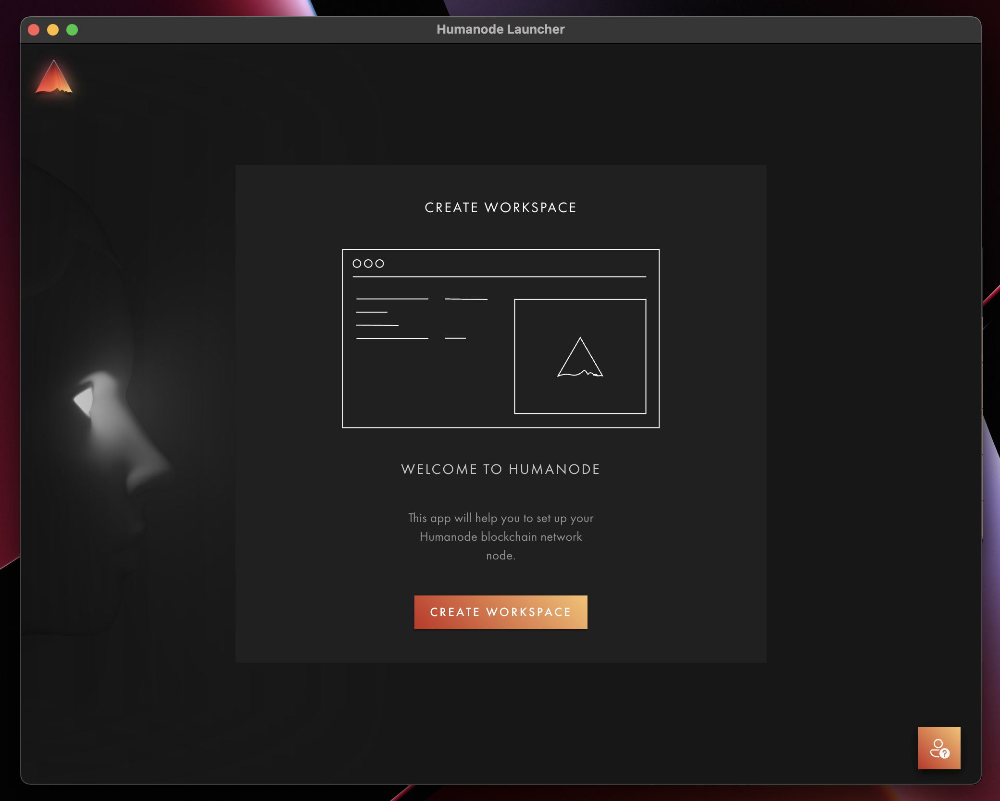

### Determining Where to Install
Select `Locally` if you are going to install it on your computer, or `Remotely` if you are going to install it on your server.
Here it is explained how to install the server.
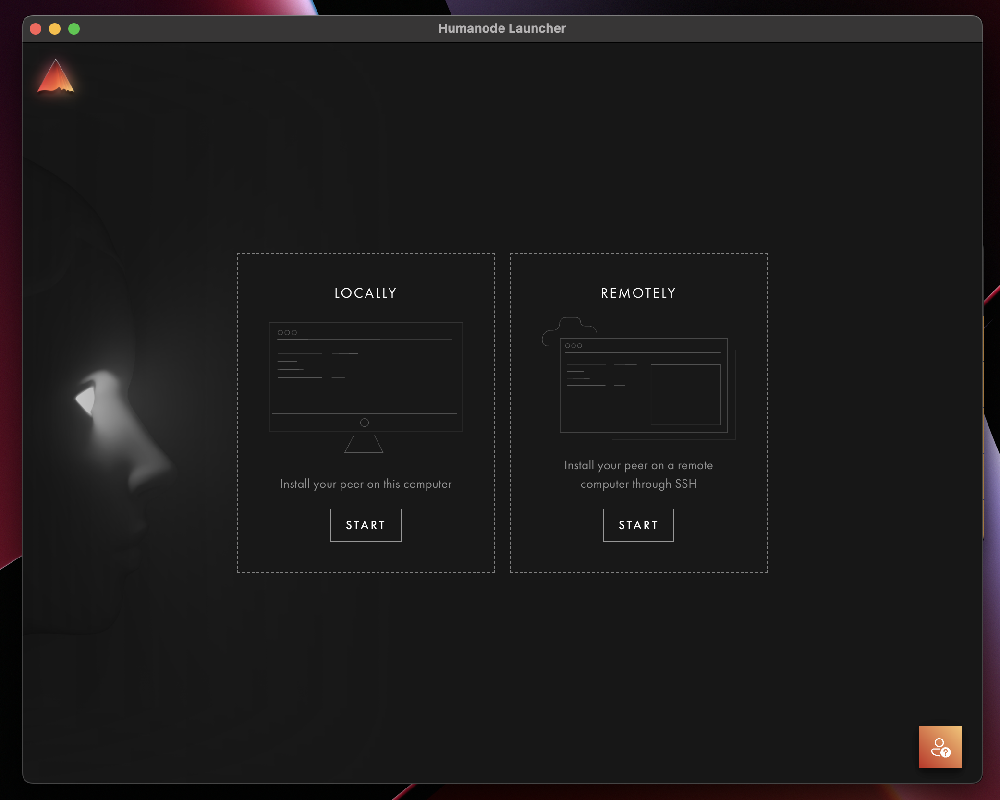

### Setting the Server Connection
1. Write your server IP address
2. Write your server username (root, ubuntu etc.)
3. Click to `+ More Connection Options`
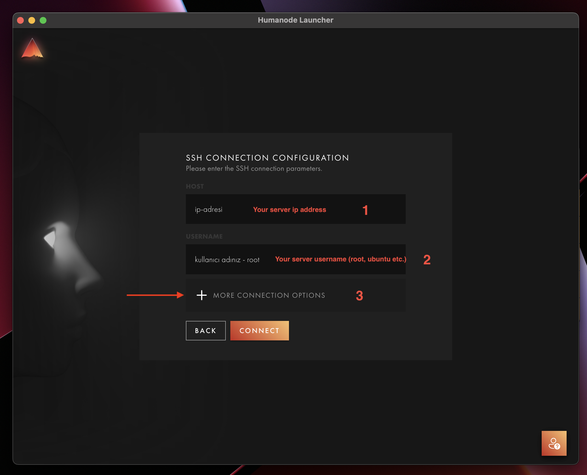

4. Select `Password` and click `Connect` buton.
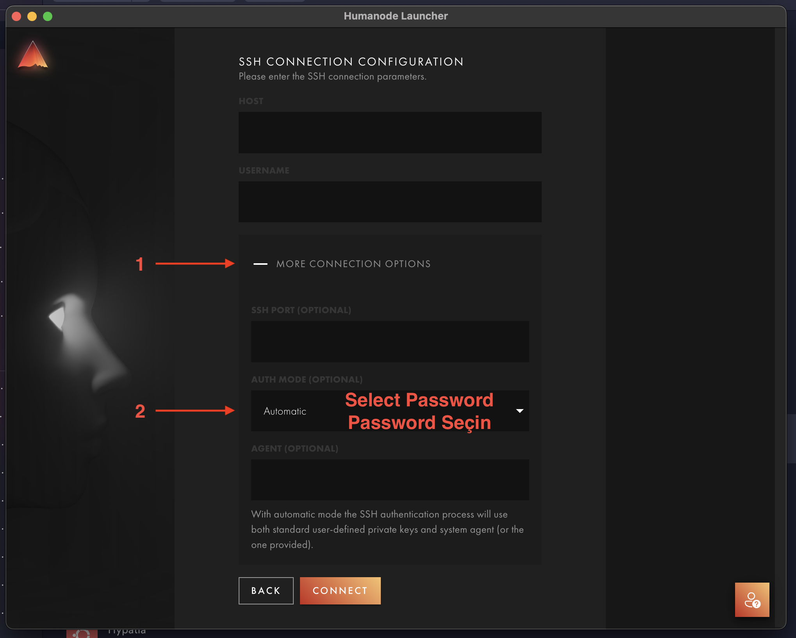

5. Write your server password and connect.
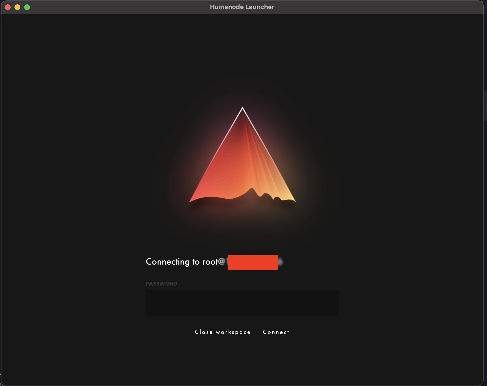

### Installing Humanode Mainnet
Select `Humanode Mainnet` and click to `Install` button.
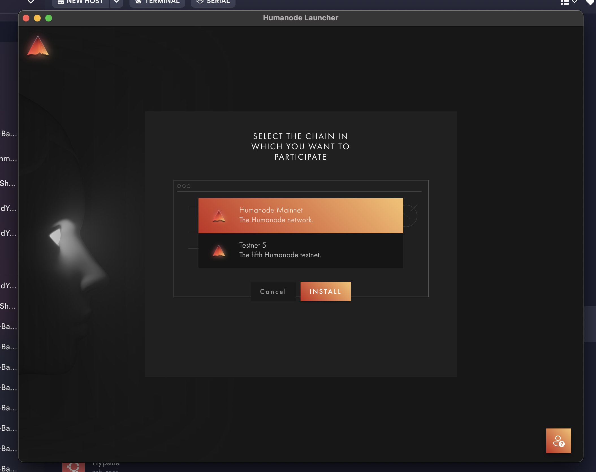

### Setting the Node Name and Wallet
1. Click on the settings tab on the screen that appears.
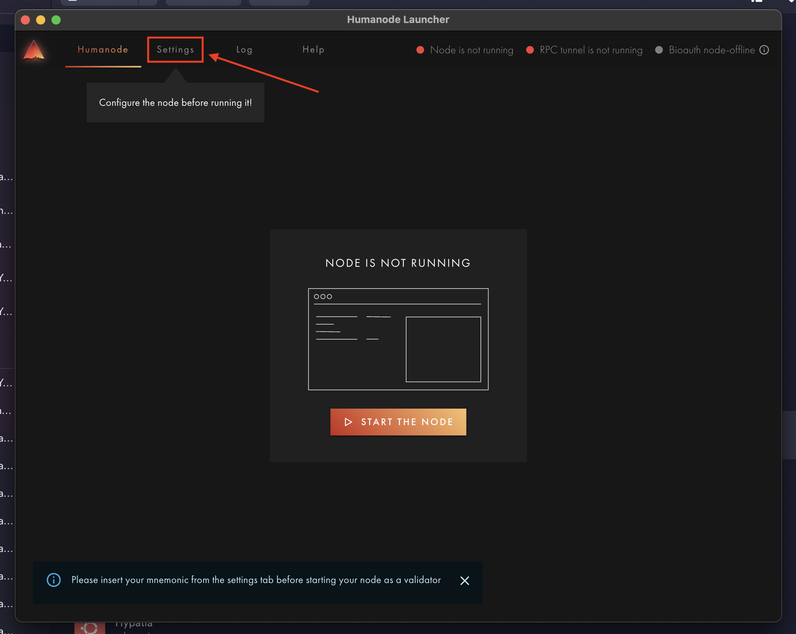

2. In the first section, write your node name and click the `Apply` button.
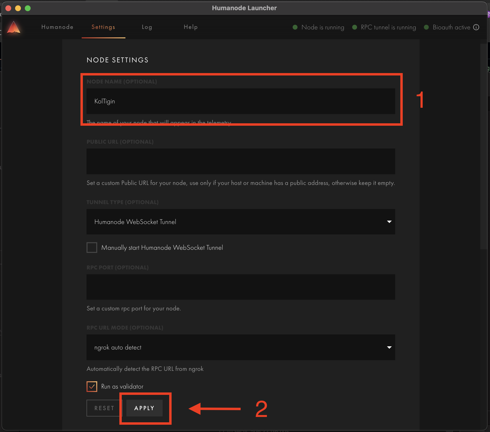

3. In the second part, if you have a wallet, write your mnemonics. If you do not have a wallet, click on the Generate button to create one and use the mnemonics given to you. And then send at least one `HMND` token to your wallet.
:::danger
Save your menemonics somewhere safe.
:::
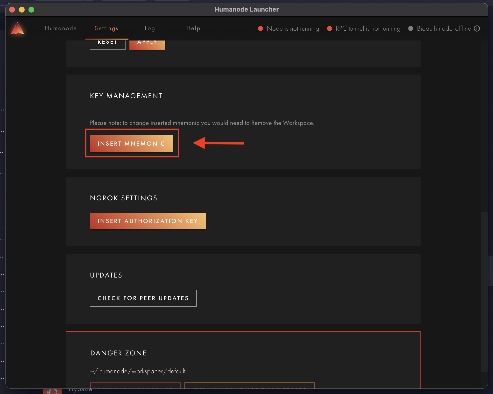
:::info
If you get an error in this section, check [here](./solutions.md).
:::

### Synchronization
On the home page, click to `START NODE` button and then wait for your node to sync. Once it is as shown in the picture below, we will move on to the next step.
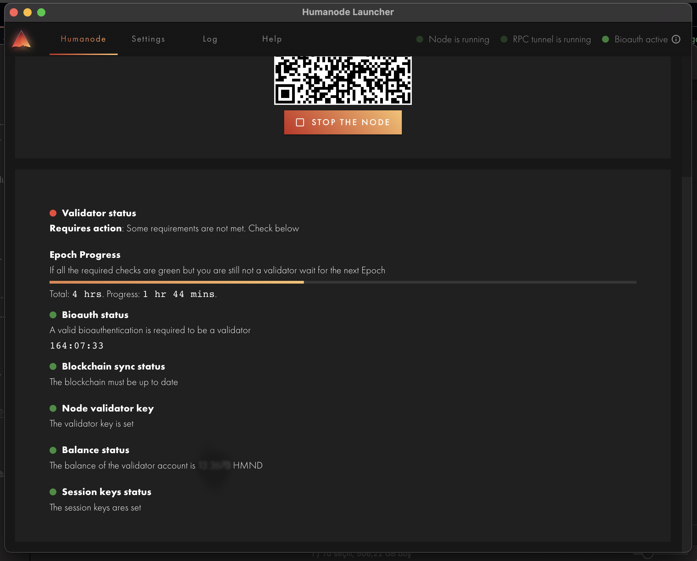

### Setup the Node
1. When you scan the barcode on the home page with your mobile phone, it will direct you to a page. There, first tap the `SETUP THE NODE` button.
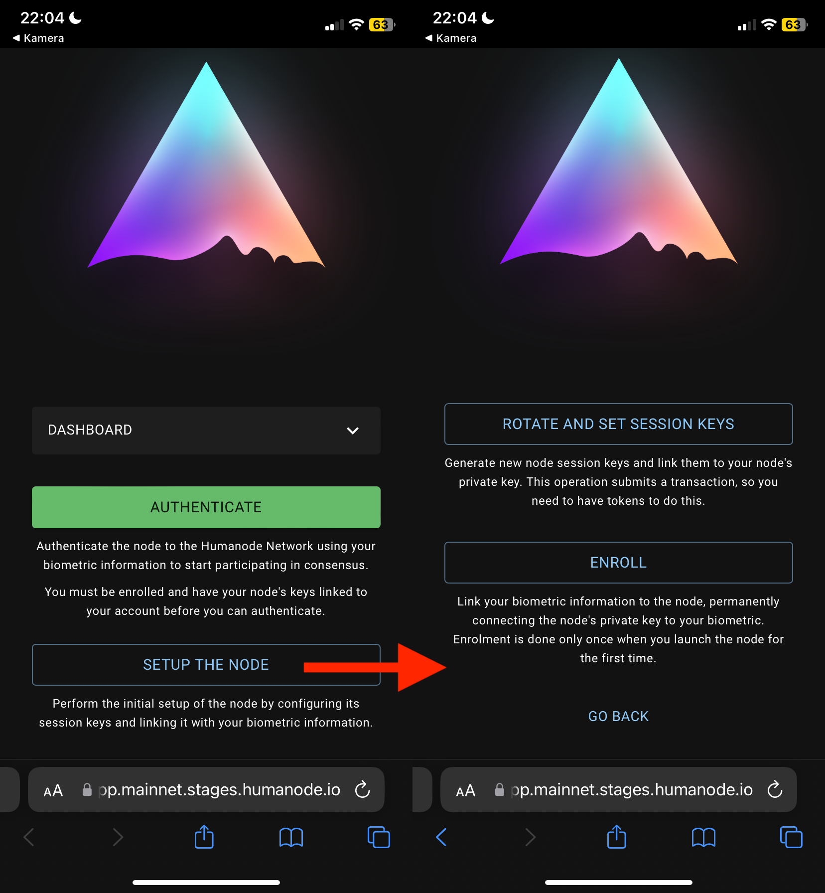

2. On the `SETUP THE NODE` page, go to the `Rotate and Set Session Keys` page shown below and press the `YES I UNDERSTAND` button to confirm. The fee for this transaction will be debited from your wallet.
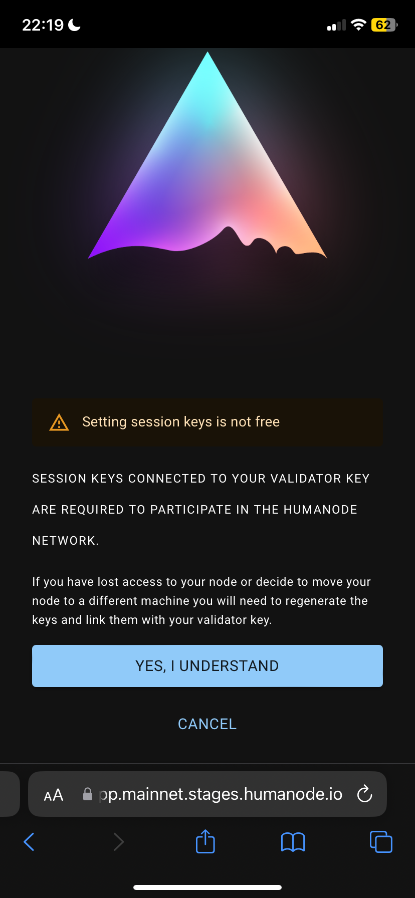

3. This time, go to the `Enroll` page on the `SETUP THE NODE` page and press the `YES I UNDERSTAND` button to confirm.
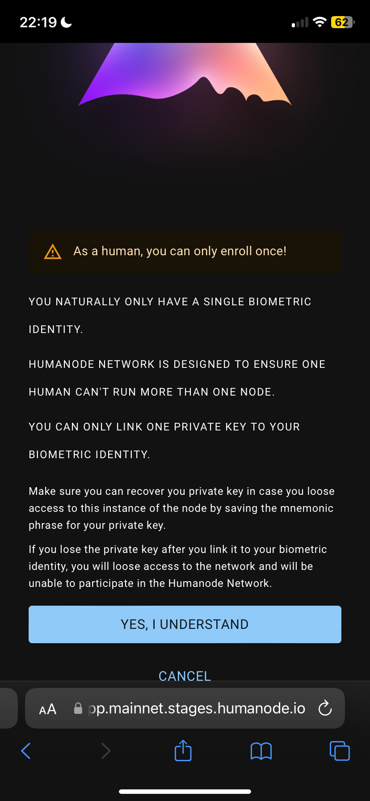

:::info
We will repeat these processes every seven days.
:::

​