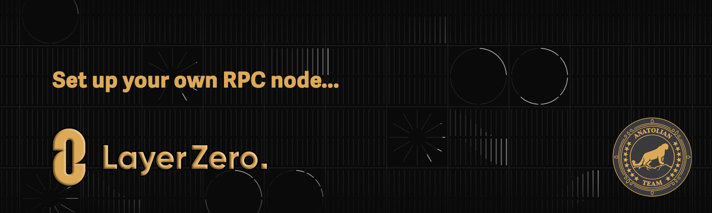

# zksync



## Links
 ✔️ [Website](https://layerzero.network/) |
 ✔️ [Docs](https://docs.layerzero.network/) |
 ✔️ [GitHub](https://github.com/LayerZero-Labs) |
 ✔️ [Discord](https://discord-layerzero.netlify.app/discord)

## Requirements

| Components | Minimum | **Recommended** |
| ------------ | ------------ | ------------ |
| CPU |	8 | 16 |
| RAM	| 16 GB | 32 GB |
| Storage	| 600 GB SSD | 1 TB SSD | 

```mdx-code-block
import DocCardList from '@theme/DocCardList';

<DocCardList />
```
