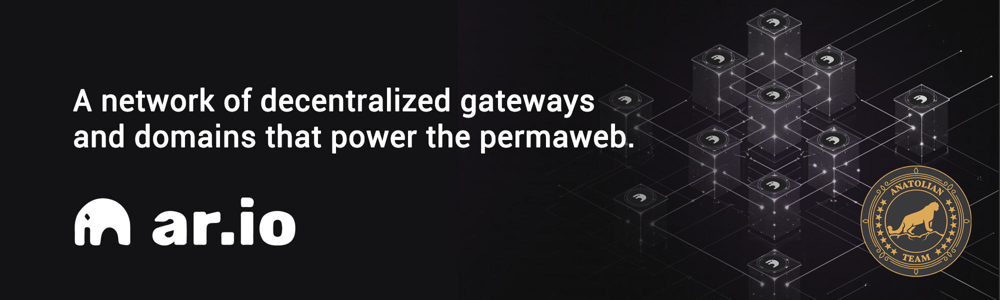

# Ar.io 

 

## Links
 ✔️ [Website](https://www.ar.io) |
 ✔️ [Blockchain Explorer](https://gateways.ar-io.dev) |
 ✔️ [Docs](https://docs.ar.io) |
 ✔️ [Discord](https://discord.gg/ApxXjvwECK) |
 ✔️ [Arscan](https://arscan.io/gateways) |
 ✔️ [Gateways](https://discord.gg/ApxXjvwECK)


## Requirements

| Components | Minimum | **Recommended** |
| ------------ | ------------ | ------------ |
| CPU |	4 | 12 |
| RAM	| 4 GB | 32 GB |
| Storage | 500 GB SSD | 2 TB SSD |

## Network Info 

* Network Name: Arweave  
* Block explorer URL: https://viewblock.io/arweave

```mdx-code-block
import DocCardList from '@theme/DocCardList';

<DocCardList />
```
