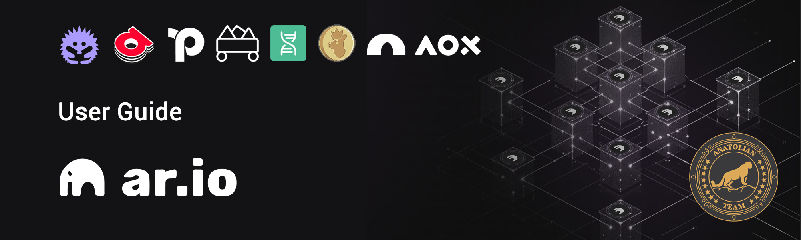

# Ar.io User Guide

What you can do in Ar.io is listed under headings below.

## **Topics:**
1. Creating a wallet.
2. Obtaining Ar Tokens.
3. Bridging Ar tokens.
4. Obtaining tARIO tokens.
5. Obtaining ArNS domains and creating subdomains.
6. Uploading files to Ardrive.
7. Delegating tARIIO tokens.
8. Using Vouch Portal.
9. Using Permaweb
10. Collecting EXP points by doing Zealy tasks and additional things that can be done.

### Wallet
We need a wallet to perform our transactions in the Arweave ecosystem. You can install the Ar Connect wallet in your browser from [here](https://www.arconnect.io/).

:::warning
Don't forget to keep your wallet keywords in a place that only you can access.
:::

### Ar Token
You need Ar token to perform our transactions. You can obtain it from exchanges.

Before performing these transactions, let's calculate the cost.

:::warning
These transactions are not investment advice. You can decide whether to participate or not by doing your own research.
:::

The minimum expenses to be made are listed below.

1. To rent an ArNS domain name (**13 characters and above**) `1013 tARIO ~ $40.6` (January 6, 2024)
2. To delegate, at least `15+ tARIO ~ $0.55-1` (January 6, 2024)
3. If you want to run a gateway, the delegation amount required to join the network is `10K tARIO ~ $333` (January 6, 2024)

* If you are not going to run a gateway node, your cost will be `41` as of January 6, 2024. If you include the price changes and fees for other transactions, it will cost at least `55`.

### Bridge

To use our Ar tokens as wAR, we go to the https://aox.xyz/#/beta bridge. It may take up to half an hour for the tokens to pass.

### Get tARIO Tokens

After the bridge process, we purchase `tARIO` tokens at https://www.permaswap.network/#/ao/WAR-TARIO?tab=swap with the tokens we receive as wAR.

### ArNS Domain Lease

Since domain purchase is expensive, we use the rental method, i.e. `Lease` option.

What you need to do is go to [ArNS](https://arns.app/) and search for your domain name, select the appropriate name and continue the process with the `Lease` option.

What you need to do next:

1. **Setting Primary Name**: Go to the `Manage Assets` page and click the `star` icon in the row where your domain is located and set your domain as the Primary Domain.

2. On the `Manage Assets` page, click the `cogwheel` icon in the row where your domain is located and find the `Undernames:` line on the page that opens, you will see the `Manage` button there. Click on it and create at least 2 all domain names here.

### Using ArDrive

Go to https://app.ardrive.io/ and upload your desired files here. Check the Assign an ArNS name box in the window that opens during uploading and select a subdomain name in the window that opens. In this way, a jpeg, gif image or pdf file that you upload will be defined to this address.

* You can upload more than 50 GB of files here. The more you upload, the better.

### Delegation

Go to https://network-portal.app/gateways#/staking and connect your wallet. Then you can stake to the desired gateways in the list that opens. We recommend that you stake at least 15+ tARIO. If you want to stake to us and our friends as a team, the addresses are below:

* **Note:** You will make us happy if you choose people who do not have 11 delegates while staking. On the page you opened, you can see the number of delegates belonging to the gateway operator in the `Active Delegates` tab.

1. [KolTigin](https://network-portal.app/gateways#/gateways/EhkVW8-6SnOm1UBVI-TJH2Hsmoz9ppv1jQMRaSo2W_g)
2. [Mandrin](https://network-portal.app/gateways#/gateways/lCzTnlf_Xmi0I0CTtsZgCI-aljcf4L0H8GcrddkDH7Y)
3. [Qavurdagli](https://network-portal.app/gateways#/gateways/BIa3UE0QEPRJC4HBSU252qHtA8ZOR4ClnzBq1LZQ_WU)
4. [MSGateway](https://network-portal.app/gateways#/gateways/Z7gvVfG9n_AXsCQL9hfpknYQawYR30DFNTuBAzWzoOk)
5. [DarksunGateway](https://network-portal.app/gateways#/gateways/99cN-yl_Ytpn-_vOOZrF39O3YST9Qe5OP9SZHP_JN7Y)
6. [New Station](https://network-portal.app/gateways#/gateways/HkRKUlJM85uaOurxShYU5TD3fCsTO0-0mhh_rcgc1Xw)

### Permaweb

Permaweb is derived from permanently web and means permanent web. You can prepare a website, blog, CV page or whatever you want to do here. You can look at this topic on [here](parmaweb.md) page.

### Vouch Portal

[Here](https://vouch-portal.arweave.net/#/intent/vouch-status) will be your passport on the permaweb. You earn points by connecting Gitcoin, Twitter. In addition to these, you also get additional points according to your AR balance and the wAR balance you stake. Try to make your score `5+`.

### Other Actions

In addition to these, you can do the following;

1. Zealy ögrevlerini yaparak EXP puan toplayabilirsiniz. Buradaki görevler eğitim odaklı olup Arweave ekosistemini ve Ar.io'yu daha iyi anlamanızı sağlayacaktır. 
Katılmak isterseniz [buradan](https://zealy.io/cw/ar-io/invite/roq3SOPBCEpxllr_O_4IB) katılabilirsiniz. You can track your points [here](https://exp.ar-io.dev/).

2. You can create an NFT collection on the [Helix](https://helix.arweave.net/) platform.

3. You can get rewards by logging in daily to [Llama Land](https://llamaland.arweave.net/#/). If you do not have $LLAMA tokens, you can get them from https://www.permaswap.network/#/ao/TARIO-LLAMA?tab=swap.

4. You can create your profile on the [Bazar](https://bazar.arweave.dev/#/collection/JAHF1fo4MECRZZFKGcT0B6XM94Lqe-3FtB4Ht_kTEK0/assets/) NFt market and buy and sell NFTs.

## Support

You can ask about any issues you are stuck on our Telegram page.