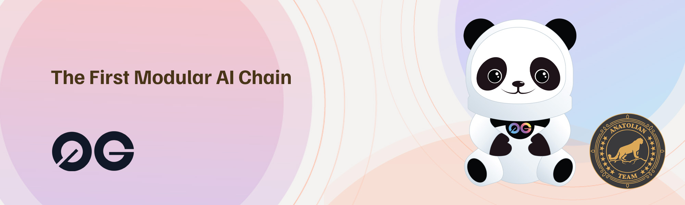

# 0G



## Links
 ✔️ [Website](https://0g.ai/) |
 ✔️ [Blockchain Explorer](https://cosmos-testnet.anatolianteam.com/0G) |
 ✔️ [Docs](https://0glabs.gitbook.io/) |
 ✔️ [GitHub](https://github.com/0glabs) |
 ✔️ [Discord](https://discord.gg/0glabs)

## Requirements

| Components | Minimum | **Recommended** |
| ------------ | ------------ | ------------ |
| CPU |	4 | 4 |
| RAM	| 8 GB | 16 GB |
| Storage	| 250 GB SSD | 500 GB SSD |

## Network Info 
* Network Chain ID: zgtendermint_16600-1
* Binary: 0gchaind
* Denom: ua0gi
* Working directory: .0gchain

## Public Services
* **RPC:** https://rpc-t-0g.anatolianteam.com/ 
* **API:** https://api-t-0g.anatolianteam.com/
* **Explorer:** https://cosmos-testnet.anatolianteam.com/0G

## Peering
You can use peer for fast connection or state sync 
```shell
PEERS="1248487ea585730cdf5d3c32e0c2a43ad0cda973@peer-zero-gravity-testnet.trusted-point.com:26326,b2a30b824a4358f8bc2ee648770b31b5eba3a853@85.10.200.82:26656"
sed -i.bak -e "s/^persistent_peers *=.*/persistent_peers = \"$PEERS\"/" $HOME/.0gchain/config/config.toml
```
The address book is updated once three hour. You can use it for quick launch.
```shell
wget -O $HOME/.0gchain/config/addrbook.json "https://testnet.anatolianteam.com/0g/addrbook.json"
```

```mdx-code-block
import DocCardList from '@theme/DocCardList';

<DocCardList />
```
