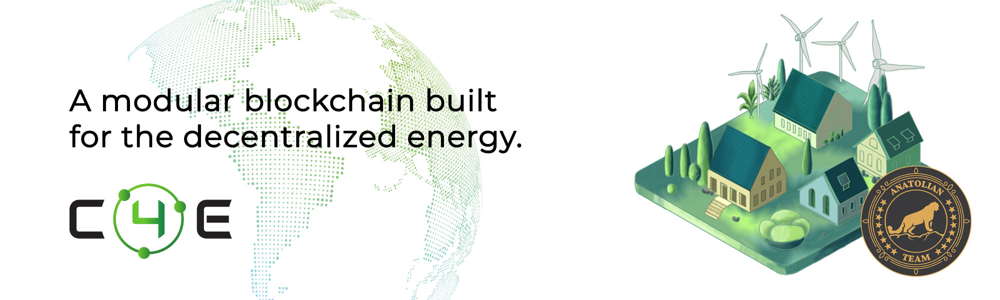

# Chain4Energy



## Links
 ✔️ [Website](https://c4e.io/) |
 ✔️ [Blockchain Explorer](https://cosmos-testnet.anatolianteam.com/Chain4Energy) |
 ✔️ [Docs](https://docs.c4e.io/) |
 ✔️ [GitHub](https://github.com/chain4energy) |
 ✔️ [Discord](https://discord.gg/chain4energy)

## Requirements

| Components | Minimum | **Recommended** |
| ------------ | ------------ | ------------ |
| CPU |	4 | 4 |
| RAM	| 8 GB | 16 GB |
| Storage	| 250 GB SSD | 500 GB SSD |

## Network Info 

* Network Chain ID: babajaga-1
* Binary: c4ed
* Denom: uc4e
* Working directory: .c4e-chain

## Public Services
* **RPC:** https://rpc-t-c4e.anatolianteam.com/
* **API:** https://api-t-c4e.anatolianteam.com/
* **Explorer:** https://cosmos-testnet.anatolianteam.com/Chain4Energy

## Peering
You can use peer for fast connection or state sync.
```shell
peers="COMING SOON"
sed -i.bak -e "s/^persistent_peers *=.*/persistent_peers = \"$peers\"/" $HOME/.c4e-chain/config/config.toml
```
The address book is updated once three hour. You can use it for quick launch.
```shell
wget -O $HOME/.c4e-chain/config/addrbook.json "https://testnet.anatolianteam.com/c4e/addrbook.json"
```

```mdx-code-block
import DocCardList from '@theme/DocCardList';

<DocCardList />
```
