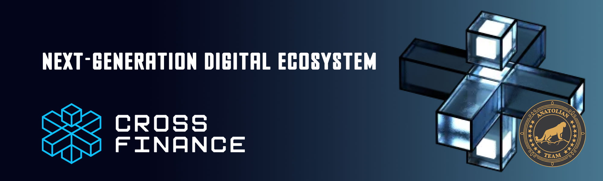

# CrossFi Network 



## Links
 ✔️ [Website](https://crossfi.org/) |
 ✔️ [Blockchain Explorer](https://cosmos-testnet.anatolianteam.com/CrossFi) |
 ✔️ [Docs](https://docs.crossfi.org) |
 ✔️ [GitHub](https://github.com/crossfichain) |
 ✔️ [Discord](https://discord.gg/crossfi)

## Requirements

| Components | Minimum | **Recommended** |
| ------------ | ------------ | ------------ |
| CPU |	4 | 4 |
| RAM	| 8 GB | 16 GB |
| Storage	| 250 GB SSD | 500 GB SSD |

## Network Info 
* Network Chain ID: crossfi-evm-testnet-1
* Binary: crossfid
* Denom: uarmpxt
* Working directory: .crossfid

## Public Services
* **RPC:** https://rpc-t-crossfi.anatolianteam.com/ 
* **API:** https://api-t-crossfi.anatolianteam.com/
* **Explorer:** https://cosmos-testnet.anatolianteam.com/CrossFi

## Peering
You can use peer for fast connection or state sync 
```shell
peers="COMING SOON"
sed -i.bak -e "s/^persistent_peers *=.*/persistent_peers = \"$peers\"/" $HOME/.crossfid/config/config.toml
```
The address book is updated once three hour. You can use it for quick launch.
```shell
wget -O $HOME/.crossfid/config/addrbook.json "https://testnet.anatolianteam.com/crossfi/addrbook.json"
```

```mdx-code-block
import DocCardList from '@theme/DocCardList';

<DocCardList />
```
