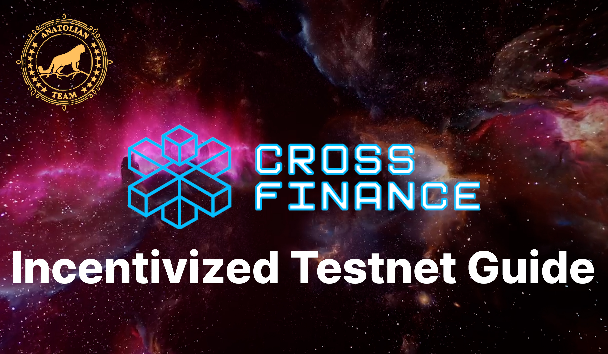

# User Guide 

## Video

## Reward Pool

$2 Million in MPX coins, which is 1.16% (100,000,000 MPX) of the total MPX coin supply.

## Things to Do in User Panel

1. Create fresh EVM wallet.
2. Got to [user panel](https://testpad.xfi.foundation/) and Sign Up to dashboard. 
3. Request tokens by connecting your telegram to Faucet.
4. Go to [XFI Console](https://test.xficonsole.com/) and complete the tasks on the [Earn XFT page](https://testpad.xfi.foundation/earn-xft).

## Things to Do in XFI Console Panel

1. Go to [XFI Console](https://test.xficonsole.com/)
2. Send MPX or XFI to the Cosmos part of the console to another Cosmos wallet address
3. Send XFI to the EVM part of the console to another EVM wallet address
4. Send MPX and/or XFI to different two addresses in one transaction
5. Send XFI and MPX to different two addresses in one transaction
6. Send Foundation token (XFT) with your wallet. Add XFI token contract (`0xDb5C548684221Ce2f55F16456Ec5Cf43a028D8e9`) to your wallet and send another wallet.
7. Delegate MPX to `Anatolian Team` validator
8. Then go to user panel and confirm you transactions.

## Transaction Control Page

You can check [transactions page](https://test.xfiscan.com/txs). You can find yourself a wallet address to perform tasks.

## Things to Do
