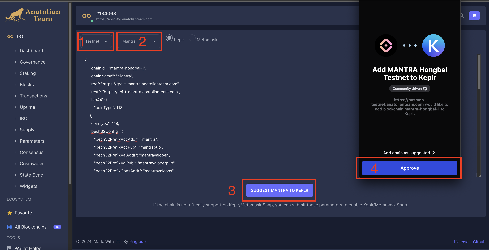
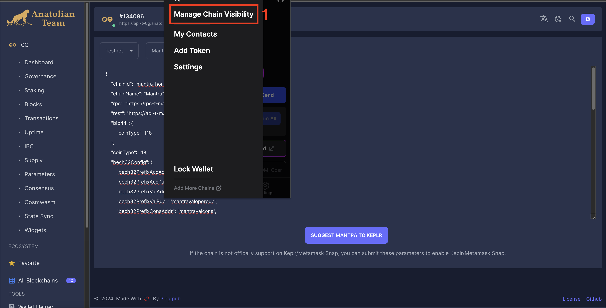
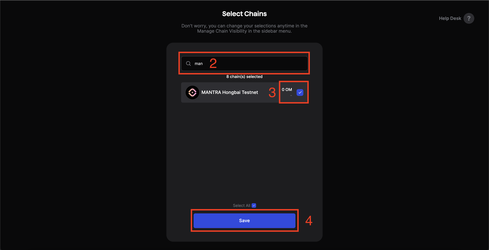
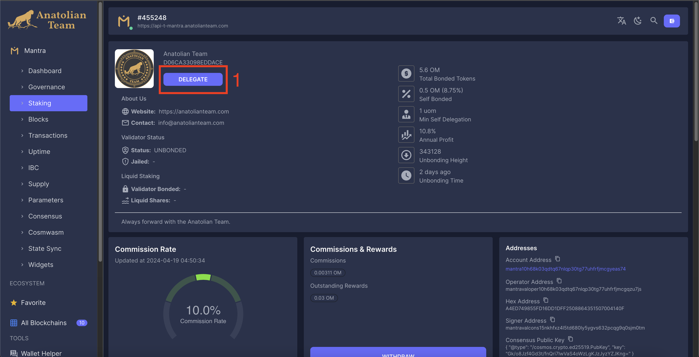
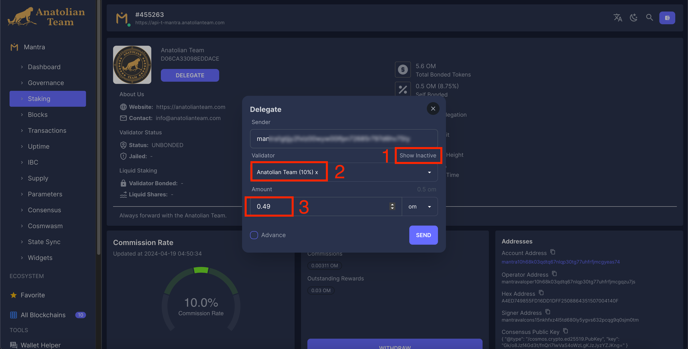

# User Guide 

## Mantra Hongbai

Go to [keplr](https://chains.keplr.app) or our [explorer](https://cosmos-testnet.anatolianteam.com/wallet/suggest) and add network to your keplr wallet.

### Add Network from Anatolian Explorer

#### Add Network

#### Activate Network

## Faucet

You can get 0.5 OM tokens once a day by going to the [Discord](https://discord.gg/3ZnyCFhxqD) server and sending a message to the `#🚰︱hongbai-faucet` channel as `/request mantra_wallet_address`.

[Faucet](https://faucet.hongbai.mantrachain.io/) website also currently redirects to discord.

## Delegate

You can go to our validator [page](https://cosmos-testnet.anatolianteam.com/Mantra/staking/mantravaloper10h68k03qdtq67nlqp30tg77uhfrfjmcgqzu7js) and you can delegate OM tokens you receive from the faucet to us.

