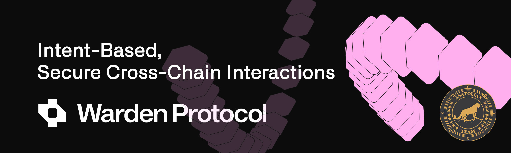

# Warden Protocol 



## Links
 ✔️ [Website](hhttps://wardenprotocol.org/) |
 ✔️ [Blockchain Explorer](https://cosmos-testnet.anatolianteam.com/Warden) |
 ✔️ [Docs](hhttps://docs.wardenprotocol.org/) |
 ✔️ [GitHub](https://github.com/warden-protocol) |
 ✔️ [Discord](https://discord.gg/wardenprotocol)

## Requirements

| Components | Minimum | **Recommended** |
| ------------ | ------------ | ------------ |
| CPU |	4 | 4 |
| RAM	| 8 GB | 16 GB |
| Storage	| 250 GB SSD | 500 GB SSD |

## Network Info 
* Network Chain ID: buenavista-1
* Binary: wardend
* Denom: uward
* Working directory: .warden

## Public Services
* **RPC:** https://rpc-t-warden.anatolianteam.com/ 
* **API:** https://api-t-warden.anatolianteam.com/
* **Explorer:** https://cosmos-testnet.anatolianteam.com/Warden

## Peering
You can use peer for fast connection or state sync 
```shell
SEEDS=""
PEERS="f9a3198644399763fe636c8dd42dd12d93f62279@85.10.200.82:26656,e1c61de5d437f35a715ac94b88ec62c482edc166@172.20.24.234:26656,c717995fd56dcf0056ed835e489788af4ffd8fe8@172.20.215.46:26656,4b477a8898fe3d160bfc87a3b7a2f293b8292d48@172.20.28.223:26656,d4af4ec2657c9756c87aa5b49d2d724b45f96d8b@188.165.228.73:26656,846bef6b31b20b075ff5b574d9733163b9b1958c@62.169.21.90:26656,22df256e71ba01bba80038c527a4f1103ad129d9@65.108.251.125:26656,a5d805241da9799d376b7e8a04e2cae22c323c56@10.0.102.171:26656,85abfb1a10ef88d37277e7462830890ff2f7a1ac@88.99.254.62:24656,999547a3b70a1b6a3d98fc13d4f9891354141166@10.0.101.171:26656,7cf7bf3e43f974b1c8d3a15531518d3ce8fb35de@31.220.75.164:26656,eb2e7095f86b24e8d5d286360c34e060a8db6334@188.40.85.207:12756,ee528080741055cb7067f3e0bdda9badac834fc5@81.0.249.86:11256,694dd68a81d0130f2c1af9f2b2891b5c9603cb7f@10.0.103.153:6656"
sed -i 's|^seeds *=.*|seeds = "'$SEEDS'"|; s|^persistent_peers *=.*|persistent_peers = "'$PEERS'"|' $HOME/.warden/config/config.toml
```
The address book is updated once three hour. You can use it for quick launch.
```shell
wget -O $HOME/.warden/config/addrbook.json "https://testnet.anatolianteam.com/warden/addrbook.json"
```

```mdx-code-block
import DocCardList from '@theme/DocCardList';

<DocCardList />
```
