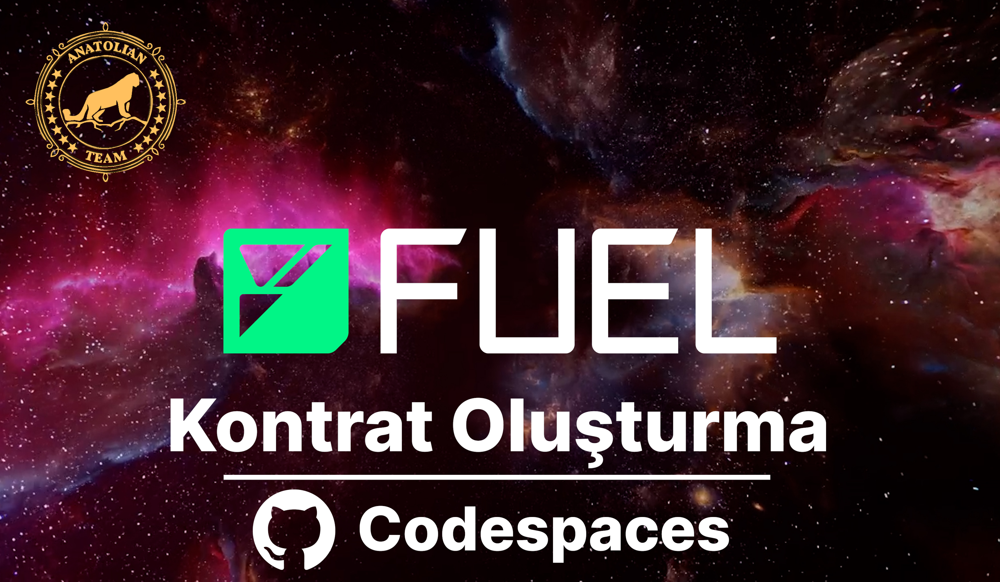

# Fuel Testnet Contract Deploy Guide
:::warning
Transactions made here do not guarantee any rewards. Think of these actions as actions you will take to improve yourself.
:::

Here it is explained how you can deploy a contract with [GitHup Codespaces](https://github.com/codespaces).

## Video
You can make your transactions by following the video below.
[](https://youtu.be/Q_bCt0ervw4)

## Updating the System and Installing Required Libraries
```shell
apt update
apt upgrade -y
apt-get install curl git screen -y
```

## Installing the Rust
```shell
curl --proto '=https' --tlsv1.3 https://sh.rustup.rs -sSf | sh
```
```shell
source $HOME/.cargo/env
```
You can check the version.
```shell
rustc --version
```

## Installing the Stable Version, Update and Default Set up 
```shell
rustup install stable
rustup update stable
rustup default stable
```

## Installing the Fuel
```shell
curl https://install.fuel.network | sh
```

```shell
source /root/.bashrc
```

### Installing and Updating the Fuel Toolchain 
```shell
fuelup toolchain install latest
fuelup self update
fuelup update && fuelup default latest
```

## Creating the Contract

```shell
mkdir fuel-project && cd fuel-project
forc new counter-contract
```
### main.sw Dosyasını Düzenleme 
```shell
nano counter-contract/src/main.sw
```
Open the file and delete everything in it, then paste the codes below, save and exit with CTRL, X, Y and Enter.

import Tabs from '@theme/Tabs';
import TabItem from '@theme/TabItem';

<Tabs>
<TabItem value="Codes for main.sw file">

```
contract;

storage {
		counter: u64 = 0,
}

abi Counter {
		#[storage(read, write)]
		fn increment();

		#[storage(read)]
		fn count() -> u64;
}

impl Counter for Contract {
		#[storage(read)]
		fn count() -> u64 {
				storage.counter.read()
		}

#[storage(read, write)]
fn increment() {
    let incremented = storage.counter.read() + 1;
    storage.counter.write(incremented);
		}
}
EOF
```

</TabItem>
</Tabs>

### Preparing the Contract
```shell
cd counter-contract
forc build
```

## Wallet

### Importing an Existing Wallet
```shell
forc wallet import 
```
If the above code gives an error, use the code below.
```shell
forc-wallet import 
```
Yukarıdak

### Creating a New Wallet
```shell
forc wallet account new
```
If the above code gives an error, use the code below.
```shell
forc-wallet new
```

:::warning
Don't forget to keep your wallet words in a safe place.
:::

## Creating the Contract
After entering the code below, first type `0` and enter, and then type `y` and enter.
```shell
forc deploy --testnet
```

You can check the TX Hash given in the output from [Fuel Explorer](https://app.fuel.network/).

