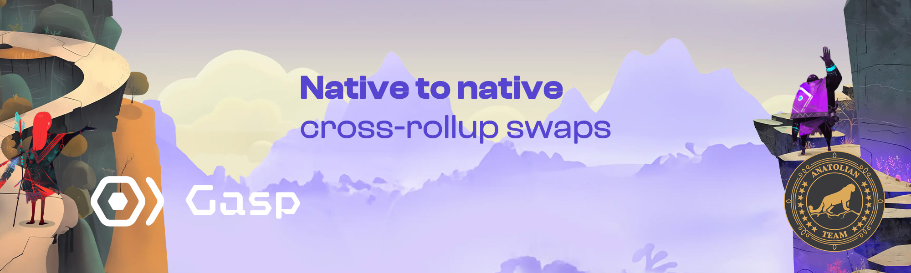

# Gasp 

 

## Links
 ✔️ [Website](https://www.gasp.xyz) |
 ✔️ [Blockchain Explorer](https://holesky.etherscan.io) |
 ✔️ [Docs](https://docs.gasp.xyz) |
 ✔️ [Discord](https://discord.gg/hcM4DfGsRa)

## Requirements

| Components | Minimum | **Recommended** |
| ------------ | ------------ | ------------ |
| CPU |	2 | 4 |
| RAM	| 4 GB | 8 GB |
| Storage | 50 GB SSD | 100 GB SSD |

| Architecture | Ubuntu | Go | 
| ------------ | ------------ | ------------ | 
| x86-64 | 20.04 or later | 1.21 or higher  |

## Network Info 

* Network Adı: Holešky  
* RPC URL: https://ethereum-holesky-rpc.publicnode.com
* Network Chain ID: 17000
* Currency symbol: holETH
* Block explorer URL: https://holesky.etherscan.io/
* Block explorer URL (Alternative): https://holesky.beaconcha.in


```mdx-code-block
import DocCardList from '@theme/DocCardList';

<DocCardList />
```
