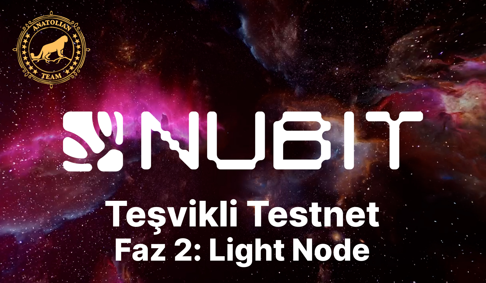

# Nubit Light Node Installation 

## Run the Script
```shell
curl -sL1 https://nubit.sh | bash
```

Then, when the logs first flow, it will give your wallet address, mnemonics, PUBKEY and AUTH KEY, save them and keep them in a safe place and press `CTRL C` and stop the node.

## Open Screen and Restart Node
```shell
screen -S nubit
```

then use the code we used first;
```shell
curl -sL1 https://nubit.sh | bash
```

Then exit the screen with `CTRL A D`.

## Getting Points

Enter the PUPKEY you saved above on the [Aplha](https://alpha.nubit.org/) page and confirm it.

## Video

[](https://youtu.be/krM2OlWnurQ)
