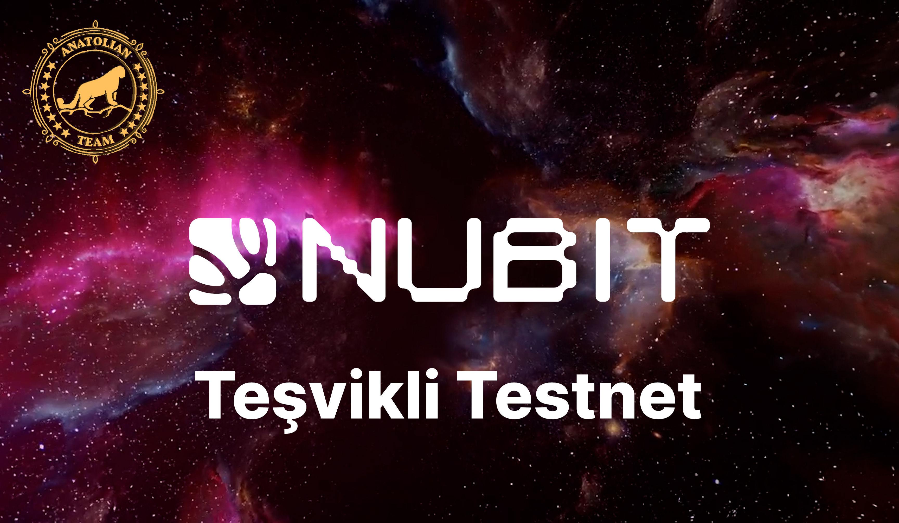

# Nubit User Guide

# Galxe Tasks

On the [Alpha](https://alpha.nubit.org/) page, you can connect your Cosmos wallet, get tokens from the tap and complete tasks.

It is briefly explained in the video below.

<LiteYouTubeEmbed
    id="okjrbxwG0Hs"
    params="autoplay=1&autohide=1&showinfo=0&rel=0"
    title="Nubit Teşvikli Testnet (Faz 1)"
    poster="hqdefault"
    webp
/>

