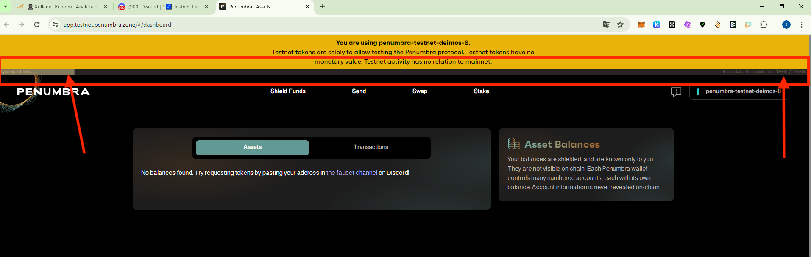
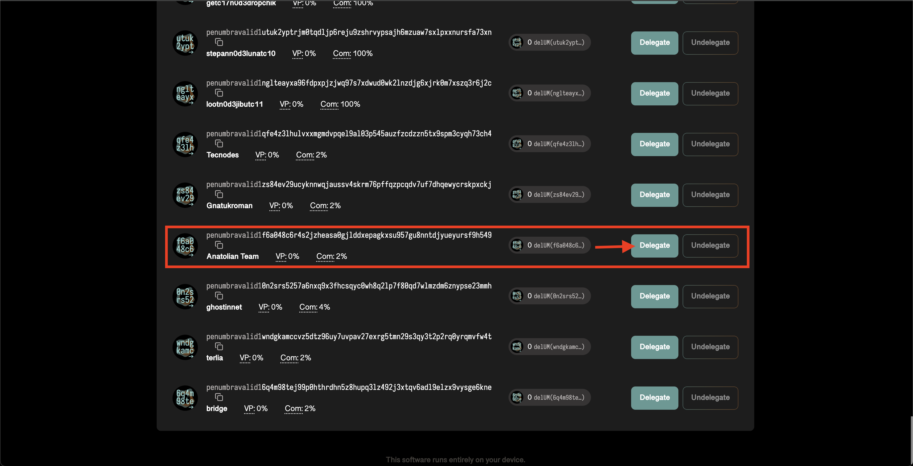
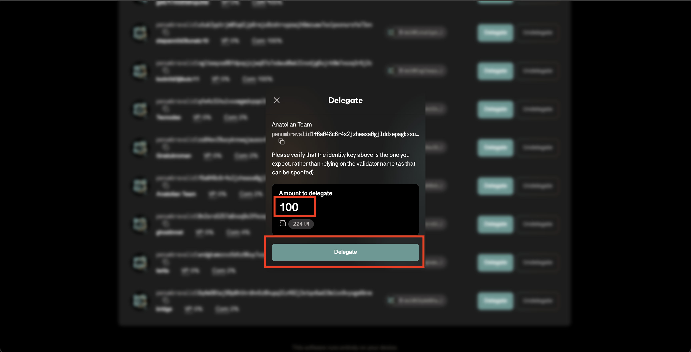
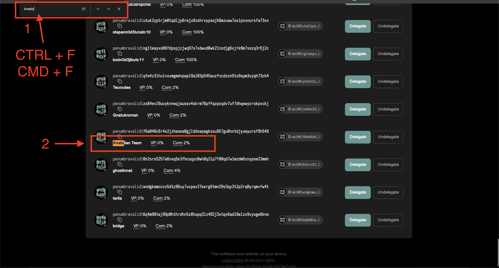
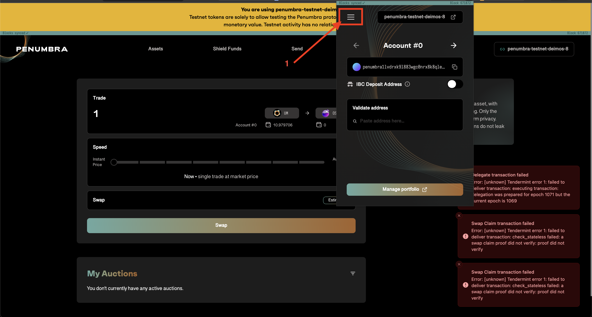
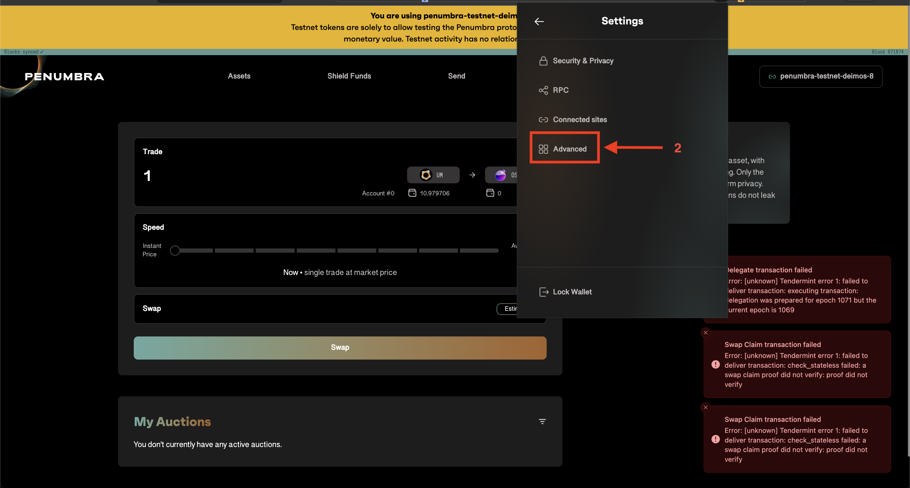
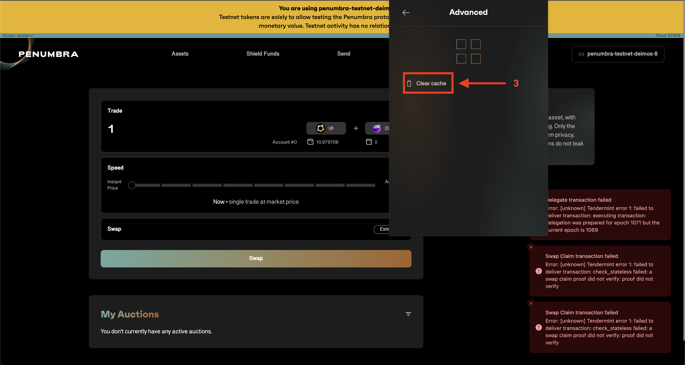
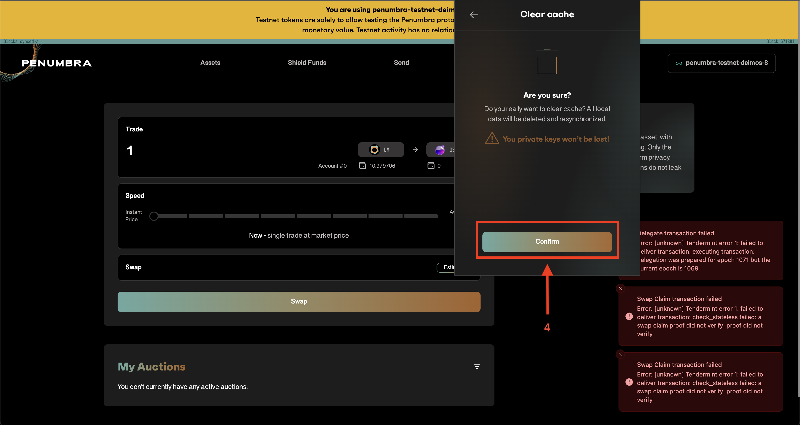
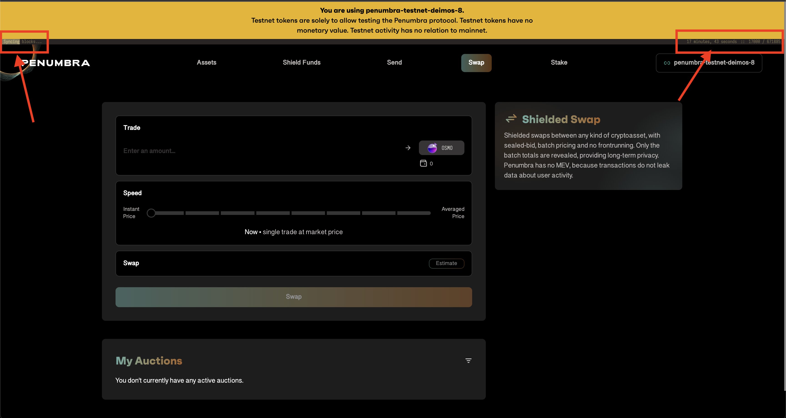

# Penumbra User Guide

## Prax Wallet

Before starting the process, install the Penumbra add-on wallet [Prax](https://chromewebstore.google.com/detail/prax-wallet/lkpmkhpnhknhmibgnmmhdhgdilepfghe) and create a wallet.

## Request Test Token

After joining the [Discord](https://discord.gg/AWshYAkKTb) server, send your wallet address to the `#🚰-testnet-faucet` channel.

:::warning
You can request tokens from the faucet `every 6 hours`. The tap is restricted against heavy use. You can receive a maximum of `100 UM` tokens per day.
:::

## Transactions

Transactions are made at https://app.testnet.penumbra.zone/. When you first connect your wallet here, your wallet will be synchronized. You need to wait for the bar shown in the picture below to be completely filled.

### Staking

Go to the [Stake](https://app.testnet.penumbra.zone/#/staking) page and you will see the validator of our team as 'Anatolian Team'. Click on the `Delegate` button and write the amount of `UM` tokens we want to stake, press the `Delegate` button and confirm from your wallet.

:::warning
If you have difficulty finding us on the page, you can press `CTRL + F` or `CMD + F` buttons and `search` for `Anatolian Team`.
:::

### Swap

Go to [Swap](https://app.testnet.penumbra.zone/#/swap) and trade other tokens.

### Sending Tokens
Go to [send](https://app.testnet.penumbra.zone/#/send) and send tokens to your friends.

You can use our [telegram chat](https://t.me/AnatolianTeam) channel to share your wallet address.

### IBC Transfer

Go to [Shield Funds](https://app.testnet.penumbra.zone/#/ibc) and send your `UM` tokens to your Osmosis or Noble test wallets.

## Getting Errors in Transactions

If you start getting errors, clear your wallet's cache, refresh the page, and then wait for your wallet to sync.

It is shown with the pictures below.

