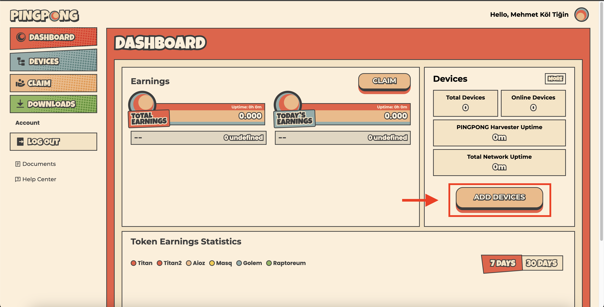

# Pingpong Installation 

Ubuntu installation is explained here.

:::warning
The server you will install on must be 22.04.
:::

**Things to do before you start:**
1. Connect to [Harvester](https://harvester.pingpong.build/) with your Google account and create an account.
2. Click on the `Add Devices` button you see in the picture below.

3. In the window that opens, enter `your device name` and get your `ID` as you see in the picture below. `This ID will be needed at the last stage.`

4. Select `Linux`. Then click on the `Let's Gooo!` button after the `installation is completed`.


## Updating the System
```shell
apt update && apt upgrade -y
```

## Installing the Necessary Libraries
```shell
apt install wget screen -y < "/dev/null"
```

## Installing the Docker
```shell
curl -fsSL https://download.docker.com/linux/ubuntu/gpg | sudo gpg --dearmor -o /usr/share/keyrings/docker-archive-keyring.gpg
echo "deb [arch=$(dpkg --print-architecture) signed-by=/usr/share/keyrings/docker-archive-keyring.gpg] https://download.docker.com/linux/ubuntu $(lsb_release -cs) stable" | sudo tee /etc/apt/sources.list.d/docker.list > /dev/null
apt-get update
apt-get install docker-ce docker-ce-cli containerd.io
docker version
```

## Downloading the Pingpong
```shell
wget https://pingpong-build.s3.ap-southeast-1.amazonaws.com/linux/latest/PINGPONG
```
> Alternative:
```shell
wget https://anatolianteam.com/PINGPONG
```

## Running the Pingpong
Open a screen.

```shell
screen -S pin
```

`ID` yazan yere panelde size verilen DI'ui yazınız.
```shell
chmod +x ./PINGPONG && ./PINGPONG --key ID
```

## Other Tasks

You can do the tasks by going to the [Application](https://app.pingpong.build/points?invite_code=FvjWneYQ) page and connecting wallet and twitter.

In addition, you can collect points by requesting your tokens on the holesky network with the wallet on the panel and doing tasks.