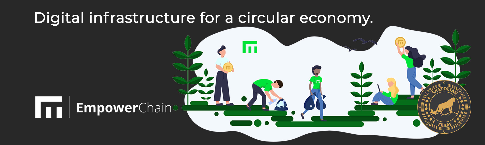

# Empower Chain



## Bağlantılar
 ✔️ [Website](https://www.empowerchain.io/) |
 ✔️ [Blockchain Explorer](https://cosmos.anatolianteam.com/empower) |
 ✔️ [Doküman](https://docs.empowerchain.io/) |
 ✔️ [GitHub](https://github.com/EmpowerPlastic/empowerchain) |
 ✔️ [Discord](https://discord.gg/UTxEzFzHVX)

## Bizimle Stake Edin ♻️
Restake kullanarak fee ücreti ödemeden auto-restake kullanarak [buradan](https://restake.app/acrechain/empowervaloper1786wmwws6avkrkx9nwv3az6g2j9ha953ydusdv) stake edebilirsiniz.

## Gereksinimler

| Bşleşenler | Minimum | **Önerilen** |
| ------------ | ------------ | ------------ |
| CPU |	4 | 8 |
| RAM	| 16 GB | 31 GB |
| Storage	| 500 GB SSD | 1 TB SSD | 

## Ağ Bilgisi 
* Network Chain ID: empowerchain-1
* Binary: empowerd
* Denom: umpwr
* Çalışma dizini: .empowerchain

## Hizmetler
* **RPC:**
    * https://empower-rpc.polkachu.com/	
    * https://rpc.empower.nodestake.top	
    * https://empowerchain.nodejumper.io:443
	* https://empower-mainnet-rpc.itrocket.net
    * http://empw.rpc.m.stavr.tech:22057
    * https://empower.rpc.stakevillage.net
    * https://rpc-empower.sr20de.xyz
* **API:**
    * https://empower-api.polkachu.com/	
    * https://api.empower.nodestake.top	
    * https://empowerchain.nodejumper.io:1317/	
    * https://empower-mainnet-api.itrocket.net
    * https://empw.api.m.stavr.tech
    * https://empower.api.stakevillage.net
    * https://api-empower.sr20de.xyz/
* **Explorer:** https://cosmos.anatolianteam.com/empower

## Peering (Yakında)
Hızlı bağlantı ya da durum senkronizasyonu (statesync) için eş (peer) kullanabilirsiniz.
```shell
peers="COMING SOON"
sed -i.bak -e "s/^persistent_peers *=.*/persistent_peers = \"$peers\"/" $HOME/.empowerchain/config/config.toml
```
Adres defteri üç saatte bir güncellenir. Hızlı başlatma için kullanabilirsiniz.
```shell
wget -O $HOME/.empowerchain/config/addrbook.json "https://testnet.anatolianteam.com/empowerchain/genesis.json"
wget -O $HOME/.empowerchain/config/addrbook.json "https://testnet.anatolianteam.com/empowerchain/addrbook.json"
```

```mdx-code-block
import DocCardList from '@theme/DocCardList';

<DocCardList />
```
