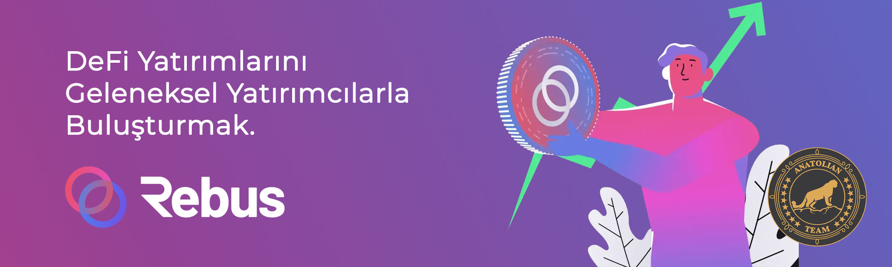

# Arable Protocol



## Bağlantılar
 ✔️ [Website](https://www.rebuschain.com/) |
 ✔️ [Blockchain Explorer](https://cosmos.anatolianteam.com/rebus) |
 ✔️ [Doküman](https://docs.rebuschain.com/) |
 ✔️ [GitHub](https://github.com/rebuschain) |
 ✔️ [Discord](https://discord.com/invite/tqfSntHxvv)

## Bizimle Stake Edin ♻️
Restake kullanarak fee ücreti ödemeden auto-restake kullanarak [buradan](https://restake.app/rebus/rebusvaloper183hv37en2dayslgf03zfr57crtjrchuazwm9h9) stake edebilirsiniz.

## Gereksinimler

| Bşleşenler | Minimum | **Önerilen** |
| ------------ | ------------ | ------------ |
| CPU |	4 | 8 |
| RAM	| 16 GB | 32 GB |
| Storage	| 500 GB SSD | 1 TB SSD | 

## Ağ Bilgisi 

* Network Chain ID: reb_1111-1
* Binary: rebusd
* Denom: arebus
* Çalışma dizini: .rebusd

## Hizmetler
* **RPC:**
    * https://api.mainnet.rebus.money:26657
    * https://rpc.rebus.nodestake.top
    * https://rebus-rpc.publicnode.com:443
* **API:**
    * https://api.mainnet.rebus.money:1317
    * https://api.rebus.nodestake.top
    * https://rebus-rest.publicnode.com
* **Explorer:** https://cosmos.anatolianteam.com/rebus

## Peering (Yakında)
Hızlı bağlantı ya da durum senkronizasyonu (statesync) için eş (peer) kullanabilirsiniz.
```shell
peers="COMING SOON"
sed -i.bak -e "s/^persistent_peers *=.*/persistent_peers = \"$peers\"/" $HOME/.rebusd/config/config.toml
```
Adres defteri üç saatte bir güncellenir. Hızlı başlatma için kullanabilirsiniz.
```shell
wget -O $HOME/.rebusd/config/addrbook.json "https://mainnet.anatolianteam.com/rebus/genesis.json"
wget -O $HOME/.rebusd/config/addrbook.json "https://mainnet.anatolianteam.com/rebus/addrbook.json"
```

```mdx-code-block
import DocCardList from '@theme/DocCardList';

<DocCardList />
```
