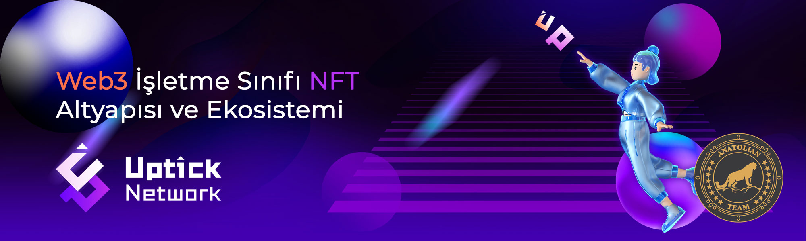

# Uptick Network



## Bağlantılar
 ✔️ [Website](https://www.uptickproject.com/) |
 ✔️ [Blockchain Explorer](https://cosmos.anatolianteam.com/uptick) |
 ✔️ [Doküman](https://upticknft.gitbook.io/uptick-network-documentation/) |
 ✔️ [GitHub](https://github.com/UptickNetwork) |
 ✔️ [Discord](https://discord.com/invite/teqX78VZUV)

## Bizimle Stake Edin ♻️
Restake kullanarak fee ücreti ödemeden auto-restake kullanarak [buradan](https://restake.app/uptick/uptickvaloper12tmn00ne92n5nljf3t5apyy2jtkfjfetdhvgca) stake edebilirsiniz.

## Gereksinimler

| Bşleşenler | Minimum | **Önerilen** |
| ------------ | ------------ | ------------ |
| CPU |	4 | 8 |
| RAM	| 16 GB | 32 GB |
| Storage	| 500 GB SSD | 1 TB SSD | 

## Ağ Bilgisi 
* Network Chain ID: uptick_117-1
* Binary: uptickd
* Denom: auptick
* Çalışma dizini: .uptickd

## Hizmetler
* **RPC:**
    * https://uptick-rpc.brocha.in:443
    * https://rpc.uptick.nodestake.org
    * https://rpc.nodejumper.io:443/uptick
* **API:**
    * https://uptick-rest.brocha.in
    * https://api.uptick.nodestake.org
    * https://rest.nodejumper.io/uptick
* **Explorer:** https://cosmos.anatolianteam.com/uptick

## Peering (Yakında)
Hızlı bağlantı ya da durum senkronizasyonu (statesync) için eş (peer) kullanabilirsiniz.
```shell
peers="COMING SOON"
sed -i.bak -e "s/^persistent_peers *=.*/persistent_peers = \"$peers\"/" $HOME/.uptickd/config/config.toml
```
Adres defteri üç saatte bir güncellenir. Hızlı başlatma için kullanabilirsiniz.
```shell
wget -O $HOME/.uptickd/config/addrbook.json "https://mainnet.anatolianteam.com/uptick/genesis.json"
wget -O $HOME/.uptickd/config/addrbook.json "https://mainnet.anatolianteam.com/uptick/addrbook.json"
```

```mdx-code-block
import DocCardList from '@theme/DocCardList';

<DocCardList />
```
