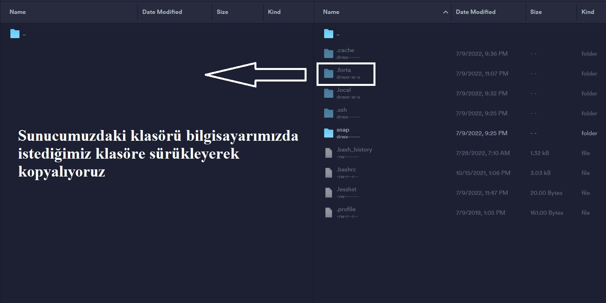
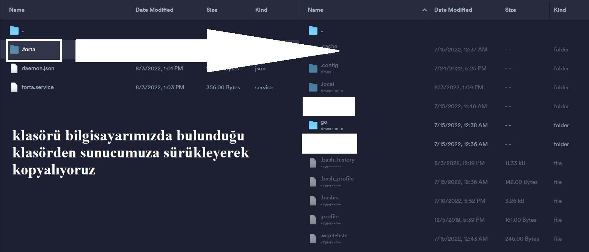
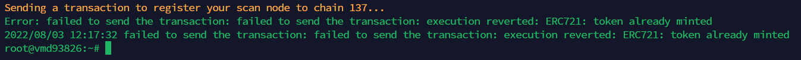

import Tabs from '@theme/Tabs';
import TabItem from '@theme/TabItem';

# Forta Node Taşıma

## .forta Klasörünün Kopyalanması
Öncelikle sunucumuza winscp, termius vb. bir program ile bağlanarak root dizininde yer alan .forta klasörünü bilgisayarımıza kopyalıyoruz.


Bu adımı gerçekleştirdikten sonra yeni sunucumuza kurulum yapıyoruz.

## Sistemi Güncelleme
```shell
sudo apt update && sudo apt upgrade -y
```

## Gerekli Kütüphanelerin Kurulması
```shell
sudo apt install ca-certificates curl gnupg lsb-release git htop liblz4-tool screen -y < "/dev/null"
```
## Docker Kurulumu
```shell
curl -fsSL https://download.docker.com/linux/ubuntu/gpg | sudo gpg --dearmor -o /usr/share/keyrings/docker-archive-keyring.gpg
echo "deb [arch=$(dpkg --print-architecture) signed-by=/usr/share/keyrings/docker-archive-keyring.gpg] https://download.docker.com/linux/ubuntu $(lsb_release -cs) stable" | sudo tee /etc/apt/sources.list.d/docker.list > /dev/null
apt-get update
apt-get install docker-ce docker-ce-cli containerd.io
docker version
```
Yukarıdaki kodları tek seferde girdiğinizde hata verirse ya da `Abort` çıktısı alırsanız, kodları tek tek giriniz.

## Docker Daemon Dosyasının Oluşturulması
```shell
sudo tee /etc/docker/daemon.json > /dev/null <<EOF
{
   "default-address-pools": [
        {
            "base":"172.17.0.0/12",
            "size":16
        },
        {
            "base":"192.168.0.0/16",
            "size":20
        },
        {
            "base":"10.99.0.0/16",
            "size":24
        }
    ]
}
EOF
```

## Docker'ı Başlatma
```shell
systemctl restart docker
```

## Forta Kurulumu

```shell
sudo curl https://dist.forta.network/pgp.public -o /usr/share/keyrings/forta-keyring.asc -s
echo 'deb [signed-by=/usr/share/keyrings/forta-keyring.asc] https://dist.forta.network/repositories/apt stable main' | sudo tee -a /etc/apt/sources.list.d/forta.list
apt-get update
apt-get install forta
```

## .forta Klasörünü Yeni Sunucuya Taşıma
Burada yeni sunucumuza kopyalamış olduğumuz .forta klasörünü bu sefer sunucumuza kopyalıyoruz.


## Yapılandırma Dosyasın Kontrol Etme
Aşağıdaki kod ile `config.yml` dosyasını açıyoruz.
```shell
nano /root/.forta/config.yml
```
Dosya içeriğinin aşağıdaki gibi olup omadığını kontrol ediyoruz. `ALCHEMY_LINKINIZ` kısmında `https` ile başlayan alchemy adresinizin de doğru olup olmadığını kontrol ediyoruz. Eğer dosya içeriği aşağıdaki gibi değilse dosya içerisindeki kodları silip aşağıdaki kodu düzenleyip dosya içerisine yapıştırıyoruz.

<Tabs>
<TabItem value="Polygon">

```shell
rm /root/.forta/config.yml
sudo tee /root/.forta/config.yml > /dev/null <<EOF
chainId: 137

scan:
  jsonRpc:
    url: ALCHEMY_LINK

trace:
  enabled: false
EOF
```

</TabItem>
<TabItem value="BSC">

```shell
rm /root/.forta/config.yml
sudo tee /root/.forta/config.yml > /dev/null <<EOF
chainId: 56

scan:
  jsonRpc:
    url: ALCHEMY_LINK

trace:
  enabled: false
EOF
```

</TabItem>
<TabItem value="Ethereum">

```shell
rm /root/.forta/config.yml
sudo tee /root/.forta/config.yml > /dev/null <<EOF
chainId: 1

scan:
  jsonRpc:
    url: ALCHEMY_LINK

trace:
  enabled: false
EOF
```

</TabItem>
<TabItem value="Arbitrum">

```shell
rm /root/.forta/config.yml
sudo tee /root/.forta/config.yml > /dev/null <<EOF
chainId: 42161

scan:
  jsonRpc:
    url: ALCHEMY_LINK

trace:
  enabled: false
EOF
```

</TabItem>
<TabItem value="Optimism">

```shell
rm /root/.forta/config.yml
sudo tee /root/.forta/config.yml > /dev/null <<EOF
chainId: 10

scan:
  jsonRpc:
    url: ALCHEMY_LINK

trace:
  enabled: false
EOF
```
</TabItem>
<TabItem value="Avalanche">

```shell
rm /root/.forta/config.yml
sudo tee /root/.forta/config.yml > /dev/null <<EOF
chainId: 43114

scan:
  jsonRpc:
    url: ALCHEMY_LINK

trace:
  enabled: false
EOF
```

</TabItem>

<TabItem value="Fantom">

```shell
rm /root/.forta/config.yml
sudo tee /root/.forta/config.yml > /dev/null <<EOF
chainId: 250

scan:
  jsonRpc:
    url: ALCHEMY_LINK

trace:
  enabled: false
EOF
```

</TabItem>
</Tabs>

## Cüzdanı Kaydetme
`EVM_ADRESINIZ` bölümünde EVM cüzdan adresinizi ve `SIFRENIZ` yerine de yukarıda Forta kurulumunda belirlediğiniz şifreyi giriyoruz.
```shell
forta register --owner-address EVM_ADRESINIZ --passphrase SIFRENIZ
```
Aşağıdaki gibi bir çıktı alıyoruz.


## Servis Dosyasını Kontrol Etme
Aşağıdaki kod ile `forta.service` dosyasını açıyoruz.
```shell
nano /lib/systemd/system/forta.service
```
Dosya içeriğinin aşağıdaki gibi olup olmadığını kontrol ediyoruz.
`SIFRENIZ` yerine ilk Forta kurulumunda belirlediğiniz şifre ile aynı olup olmadığını kontrol ediyoruz.
```
sudo tee /lib/systemd/system/forta.service > /dev/null <<EOF
[Unit]
Description=Forta
After=network-online.target
Wants=network-online.target systemd-networkd-wait-online.service

StartLimitIntervalSec=500
StartLimitBurst=5

[Service]
Environment="FORTA_DIR=/root/.forta/"
Environment="FORTA_PASSPHRASE=SIFRENIZ"
Restart=on-failure
RestartSec=15s

ExecStart=/usr/bin/forta run

[Install]
WantedBy=multi-user.target
EOF
```

## Forta Node Aktif Etme ve Çalıştırma
```shell
systemctl daemon-reload
systemctl restart forta
```

## Node Durumunu Kontrol Ediyoruz
Son olarak node'umuzu kontrol ediyoruz.
```shell
systemctl status forta
```
Aşağıdaki gibi bir çıktı aldıysanız taşıma işlemi başarıyla tamamlanmıştır.


