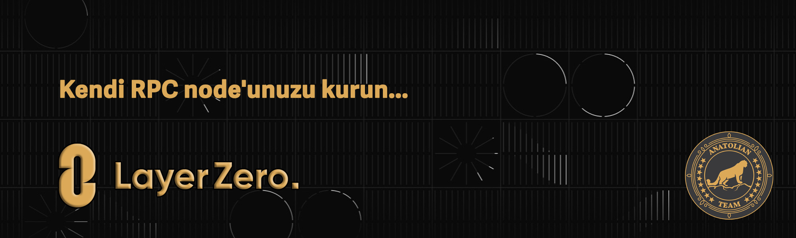

# zksync



## Bağlantılar
 ✔️ [Website](https://layerzero.network/) |
 ✔️ [Doküman](https://docs.layerzero.network/) |
 ✔️ [GitHub](https://github.com/LayerZero-Labs) |
 ✔️ [Discord](https://discord-layerzero.netlify.app/discord)

## Gereksinimler

| Bşleşenler | Minimum | **Önerilen** |
| ------------ | ------------ | ------------ |
| CPU |	8 | 16 |
| RAM	| 16 GB | 32 GB |
| Disk	| 1 TB SSD | 2 TB SSD | 

```mdx-code-block
import DocCardList from '@theme/DocCardList';

<DocCardList />
```
