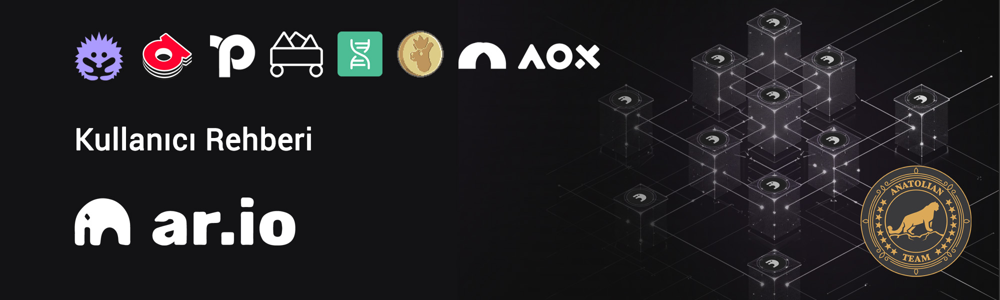

# Ar.io Kullanıcı Rehberi

Ar.io'da yapabilecekleriniz aşağıda başlıklar halinde sıralanmıştır. 

## Konu başlıkları
1. Cüzdan oluşturma.
2. Ar Token temin etme.
3. Ar tokenleri köprüleme.
4. tARIO token alma.
5. ArNS domain alma ve alt alan adları oluşturma.
6. Ardrive'a dosya yükleme.
7. tARIİO token delege etme.
8. Vouch Portal kullanma.
9. Permaweb kullanımı
10. Zealy görevlerini yaparak EXP puan toplama ve ek olarak yapıalbilecekler.

### Cüzdan
Arweave ekosisteminde işlemlerimizi yapmak için biz cüzdana ihtiyacımız var. [Buradan](https://www.arconnect.io/) Ar Connect cüzdanı tarayıcınıza kurabilirsiniz. 

:::warning
Cüzdan kelimelerinizi sadece sizin ulaşabileceğiniz bir yerde saklamayı unutmayın. 
:::

### Ar Token
İşlemlerimizi yapmak için Ar tokene ihtiyacınız var. Borsalardan temin edebilirsiniz. 

Bu işlemleri yapmadan önce maliyet hesabı yapalım. 

:::warning
Bu işlemler bir yatırım tavsiyesi değildir. Kendi araştrmanızı yaparak dahil olup olmamaya karar verebilirsiniz.
:::

Yapılacak min. harcamalar aşağıda liste halinde sunulmuştur.

1. ArNS alan adı kiralamak için (**13 karakter ve üzeri**) `1013 tARIO ~ 40,6$` (6 Ocak 2024)
2. Delege etmek için en az `15+ tARIO ~ 0,55-1$` (6 Ocak 2024)
3. Eğer bir ağ geçidi çalıştırmak isterseniz ağa katılmak için gereken delegasyon miktarı `10K tARIO ~ 333$` (6 Ocak 2024)

* `Eğer bir ağ geçidi node'u çalıştırmayacak iseniz maliyetiniz` 6 Ocak 2024 trihi itibariyle `41$` olacaktır. Bunlara fiyat değişimlerini ve yapılacak diğer işlemler için gerekecek fee ücretlerini de dahil ederseniz, en azından `55 Dolara` mal olacaktır.

### Köprü İşlemi

Elimizdeki Ar tokenleri wAR olarak kullanabilmek için https://aox.xyz/#/beta köprüsüne gidiyoruz. Tokenlerin geçmesi yarım saati bulabilir. 

### tARIO Token Alma

Köprü işleminden sonra wAR olarak aldığımız tokenler ile https://www.permaswap.network/#/ao/WAR-TARIO?tab=swap adresinde `tARIO` token alıyoruz.

### ArNS Domain Alma

Domain almak pahalı olduğu için kiralama yönetemini yani `Lease` seçeneğini kullanıyoruz.

Yapmanız gereken [ArNS](https://arns.app/) adresine gidip alan adınız için arama yapın ve uygun olan adı seçip işleme `Lease` seçeneği ile devam edin.

Bundan sonra yapmanız gerekenler: 
1. **Primary Name ayarlama**: `Manage Assets` sayfasına gidin ve domaininizin bulunduğu satırda `yıldız` simgesine tıklayın ve domaininizi Primary Domain olarak ayarlayın.
2. `Manage Assets` sayfasında domaininizin bulunduğu satırda `çark` simgesine tıklayın ve açılan sayfada `Undernames:` satırını bulun orada `Manage` butonunu göreceksiniz. Ona tıklayın ve burada en az 2 adet all alan adı oluşturun.

### ArDrive Kullanma

https://app.ardrive.io/ adresine gidin burada istediğiniz dosyalarınızı yükleyin. Yükleme esnasında açılan pencerede Assign an ArNS name kutucuğunu işaretleyin ve açılan pencerede bir alt alan adı seçin. Bu sayede yükediğiniz bir jpeg, gif resim ya da pdf doyası bu adrese tanımlanmış olacaktır.

* Burada 50 GB'tan fazla dosya yükleyebilirsiniz. Ne kadr yüklerseniz iyi olur.

### Delegasyon

https://network-portal.app/gateways#/staking adresine giderek cüzdanınızı bağlayın. ardından açılan listede istediğiniz ağ geçitlerine stake işlemi yapabilirsiniz. En az 15+ tARIO stake etmenizi tavsiye ederiz. Ekip olarak bizlere ve tanıdığımız dostlarımıza stake etmek isterseniz adresler aşağıdadır:

* **Not:** Stake ederken 11 delege sayısına sahip olmayan kişileri seçerseniz bizleri mutlu edersiniz. Açtığınız sayfada ağ geçidi operatorüne ait delege sayısını `Active Delegates` sekmesinde görebilirsiniz.
1. [KolTigin](https://network-portal.app/gateways#/gateways/EhkVW8-6SnOm1UBVI-TJH2Hsmoz9ppv1jQMRaSo2W_g)
2. [Mandrin](https://network-portal.app/gateways#/gateways/lCzTnlf_Xmi0I0CTtsZgCI-aljcf4L0H8GcrddkDH7Y)
3. [Qavurdagli](https://network-portal.app/gateways#/gateways/BIa3UE0QEPRJC4HBSU252qHtA8ZOR4ClnzBq1LZQ_WU)
4. [MSGateway](https://network-portal.app/gateways#/gateways/Z7gvVfG9n_AXsCQL9hfpknYQawYR30DFNTuBAzWzoOk) 
5. [DarksunGateway](https://network-portal.app/gateways#/gateways/99cN-yl_Ytpn-_vOOZrF39O3YST9Qe5OP9SZHP_JN7Y)
6. [New Station](https://network-portal.app/gateways#/gateways/HkRKUlJM85uaOurxShYU5TD3fCsTO0-0mhh_rcgc1Xw)

### Permaweb 

Permaweb, permanently web'ten türetilmiş olup Kalıcı web anlamına gelmektedir. Websitesi, blog, CV sayfası ya da her ne yapmak istiyorsanız burada hazırlayabilirsiniz. Bu konuya [buradaki](parmaweb.md) sayfadan bakabilirsiniz.

### Vouch Portal

[Burası](https://vouch-portal.arweave.net/#/intent/vouch-status) permaweb'teki pasaportunuz olacaktır. Gitcoin, Twitter bağlayarak puan kazanırsınız. Bunlara ek olarak AR bakiyeniz ve stake ettiğiniz wAR bakiyesine göre de ek puanlar alırsınız. Puanınızı `5+` yapmaya çalışın. 

### Yapılabilecek Diğer İşlemler

Bunlara ek olarak yapabileceğiniz şeyler şunlardır;

1. Zealy ögrevlerini yaparak EXP puan toplayabilirsiniz. Buradaki görevler eğitim odaklı olup Arweave ekosistemini ve Ar.io'yu daha iyi anlamanızı sağlayacaktır. 
Katılmak isterseniz [buradan](https://zealy.io/cw/ar-io/invite/roq3SOPBCEpxllr_O_4IB) katılabilirsiniz. Puanları [buradan](https://exp.ar-io.dev/) takip edebilirsiniz.
2. [Helix](https://helix.arweave.net/) platfromunda NFT koleksiyonu oluşturabilirsiniz.
3. [Llama Land ](https://llamaland.arweave.net/#/)adresine günlük giriş yaparak ödül alabilirsiniz. Eğer $LLAMA tokeniniz yok ise https://www.permaswap.network/#/ao/TARIO-LLAMA?tab=swap adresinden temin edebilirsiniz.
4. [Bazar](https://bazar.arweave.dev/#/collection/JAHF1fo4MECRZZFKGcT0B6XM94Lqe-3FtB4Ht_kTEK0/assets/) NFt markette profilinizi oluşturup NFT alıp satabilirsiniz.

## Destek

Takıldığınız konularda Telegram sayfamızdan sorabilirsiniz.