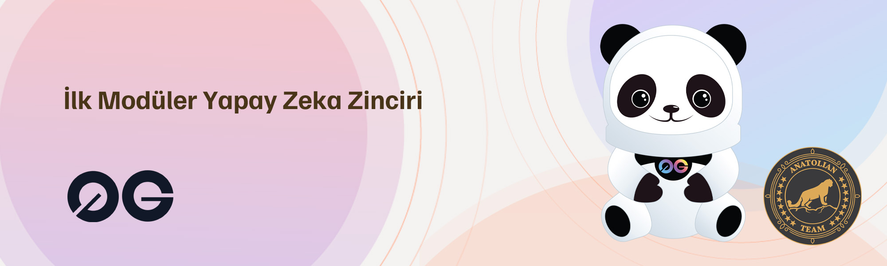

# 0G Protocol



## Bağlantılar
 ✔️ [Website](https://0g.ai/) |
 ✔️ [Blockchain Explorer](https://cosmos-testnet.anatolianteam.com/0G) |
 ✔️ [Doküman](https://0glabs.gitbook.io/) |
 ✔️ [GitHub](https://github.com/0glabs) |
 ✔️ [Discord](https://discord.gg/0glabs)

## Gereksinimler

| Bşleşenler | Minimum | **Önerilen** |
| ------------ | ------------ | ------------ |
| CPU |	4 | 4 |
| RAM	| 8 GB | 16 GB |
| Storage	| 250 GB SSD | 500 GB SSD | 

## Ağ Bilgisi 

* Network Chain ID: zgtendermint_9000-1
* Binary: evmosd
* Denom: aevmos
* Çalışma dizini: .evmosd

## Hizmetler
* **RPC:** https://rpc-t-0g.anatolianteam.com/ 
* **API:** https://api-t-0g.anatolianteam.com/
* **Explorer:** https://cosmos-testnet.anatolianteam.com/0G

## Peering
Hızlı bağlantı ya da durum senkronizasyonu (statesync) için eş (peer) kullanabilirsiniz.
```shell
PEERS="1248487ea585730cdf5d3c32e0c2a43ad0cda973@peer-zero-gravity-testnet.trusted-point.com:26326"
sed -i.bak -e "s/^persistent_peers *=.*/persistent_peers = \"$PEERS\"/" $HOME/.evmosd/config/config.toml
```
Adres defteri üç saatte bir güncellenir. Hızlı başlatma için kullanabilirsiniz.
```shell
wget -O $HOME/.evmosd/config/addrbook.json "https://testnet.anatolianteam.com/0g/addrbook.json"
```

```mdx-code-block
import DocCardList from '@theme/DocCardList';

<DocCardList />
```
