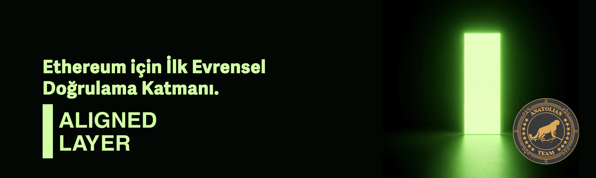

# Aligned Layer



## Bağlantılar
 ✔️ [Website](https://alignedlayer.com/) |
 ✔️ [Blockchain Explorer](https://cosmos-testnet.anatolianteam.com/alignedlayer) |
 ✔️ [GitHub](https://github.com/yetanotherco/aligned_layer) |
 ✔️ [Discord](discord.gg/alignedlayer)

## Gereksinimler

| Bşleşenler | Minimum | **Önerilen** |
| ------------ | ------------ | ------------ |
| CPU |	4 | 4 |
| RAM	| 8 GB | 16 GB |
| Storage	| 250 GB SSD | 500 GB SSD | 

## Ağ Bilgisi 

* Network Chain ID: alignedlayer
* Binary: alignedlayerd
* Denom: stake
* Çalışma dizini: .alignedlayer

## Hizmetler
* **RPC:** https://rpc-t-aligned.anatolianteam.com/ 
* **API:** https://api-t-aligned.anatolianteam.com/
* **Explorer:** https://cosmos-testnet.anatolianteam.com/alignedlayer

## Peering
Hızlı bağlantı ya da durum senkronizasyonu (statesync) için eş (peer) kullanabilirsiniz.
```shell
PEERS="144c2d4fbbaf54dda837bfbc88b688fb2f02c92f@alignedlayer-testnet-peer.itrocket.net:50656,2567ea5aed4bba4e3062a1072a8f1e7fb4e4497c@65.109.85.36:26656,51ca4087558ebe93a16e3f1e84a969d30e7a91f1@95.216.245.35:26656,4093bf12076818a82f9fc1c75dc974e1d93daf44@195.201.30.159:26656,692729135ab36bf8e9fbd65ce8f1913665bed299@188.40.109.171:26656,18e1adeadb8cc596375e4212288fcd00690df067@213.199.48.195:26656,7292de855372480ae23dbcaf94d36ead187cf6a8@194.163.143.206:50656,ce179504bdaf4b6712d60c79b5de7f3358cce123@64.23.185.7:26656,a1d6d9569789a7a8765f0a4899439819f07755d4@213.133.103.213:26656,afeea4cd47aa80504adbdaa8aa019864e291de55@[2a03:cfc0:8000:13::b910:277f]:13356,a13fb2409c481aa9f81585167447ae813164d021@65.21.89.233:12656"
sed -i 's|^persistent_peers *=.*|persistent_peers = "'$PEERS'"|' $HOME/.alignedlayer/config/config.toml
```
Adres defteri üç saatte bir güncellenir. Hızlı başlatma için kullanabilirsiniz.
```shell
wget -O $HOME/.alignedlayer/config/addrbook.json "https://testnet.anatolianteam.com/Aligned/addrbook.json"
```

```mdx-code-block
import DocCardList from '@theme/DocCardList';

<DocCardList />
```
