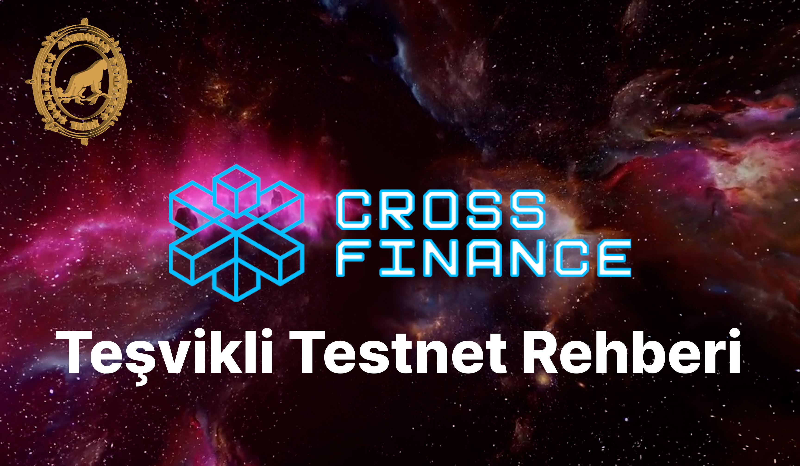

# Kullanıcı Rehberi

## Video

## Ödül Havuzu

Toplam MPX arzının %1,16'sına (100.000.000 MPX) karşılık gelen 2 Milyon dolarlık MPX token dağıtılacak.

## Kullanıcı Panelinde Yapılacaklar

1. Yeni bir EVM cüzdanı oluşturun.
2. [Kullanıcı paneline](https://testpad.xfi.foundation/) gidin ve kontrol paneline kaydolun.
3. Telgramınızı Faucet'e bağlayarak token isteyin.
4. [XFI Konsoluna](https://test.xficonsole.com/) gidin ve [XFT Earn sayfasındaki](https://testpad.xfi.foundation/earn-xft) görevleri tamamlayın.

## XFI Konsol Panelinde Yapılacak Şeyler

1. [XFI Konsoluna](https://test.xficonsole.com/) gidin
2. MPX veya XFI'yi konsolun Cosmos kısmına başka bir Cosmos cüzdan adresine gönderin
3. XFI'yi konsolun EVM kısmına başka bir EVM cüzdan adresine gönderin
4. Tek işlemde MPX ve/veya XFI'yi farklı iki adrese gönderin
5. XFI ve MPX'i tek işlemde farklı iki adrese gönderin
6. Cüzdanınızla Foundation token'ı (XFT) gönderin. Cüzdanınıza XFI token sözleşmesini (`0xDb5C548684221Ce2f55F16456Ec5Cf43a028D8e9`) ekleyin ve başka bir cüzdana gönderin.
7. 'Anatolian Team' doğrulayıcısına MPX stake edin.
8. Daha sonra kullanıcı paneline giderek işlemlerinizi onaylayın.

## İşlem Kontrol Sayfası

[İşlemler sayfasını](https://test.xfiscan.com/txs) kontrol edebilirsiniz. Görevleri gerçekleştirmek için kendinize bir cüzdan adresi bulabilirsiniz.
