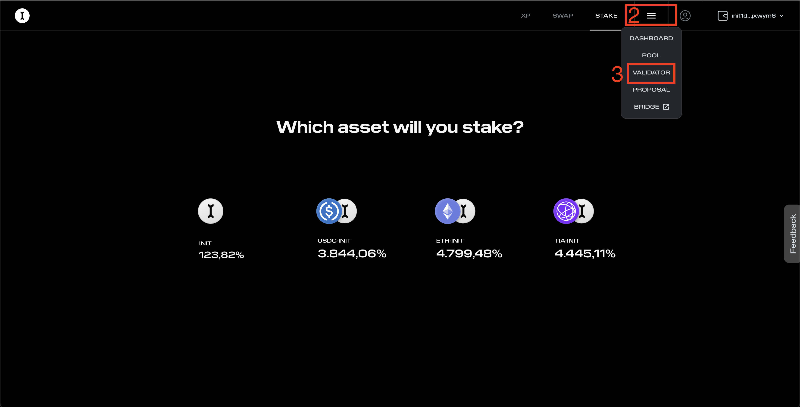
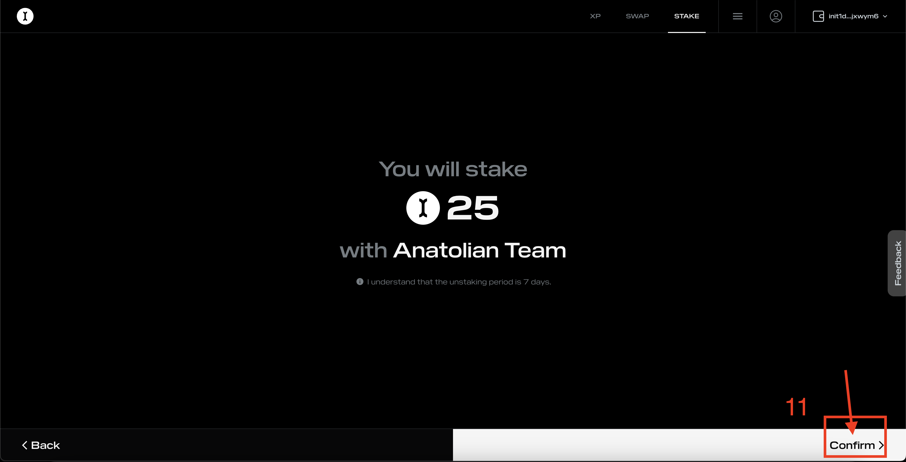

# Kullanıcı Rehberi

Initia testnetinde bizi desteklemek isterseniz aşağıdaki adımları uygulyabilirsiniz. Destekleriniz için teşekkür ederiz.

## Initia Wallet

Go to [extension page](https://chromewebstore.google.com/detail/initia-wallet/ffbceckpkpbcmgiaehlloocglmijnpmp) and install wallet to your browser.

## Initia Faucet

Go to [faucet](https://faucet.testnet.initia.xyz/) and claim tokens.

## Initia Testnet Page and Staking

Go to [testnet page](https://app.testnet.initia.xyz/) and follow the steps mentioned in the images below.

1. Select Stake

2. Select Validator

3. Select Inactive Validator Tab

4. Write Anatolian Team and Select

5. Select Stake
#### Add Network

6. Select Init
#### Activate Network

7. Write the token amount

8. And Confirm

