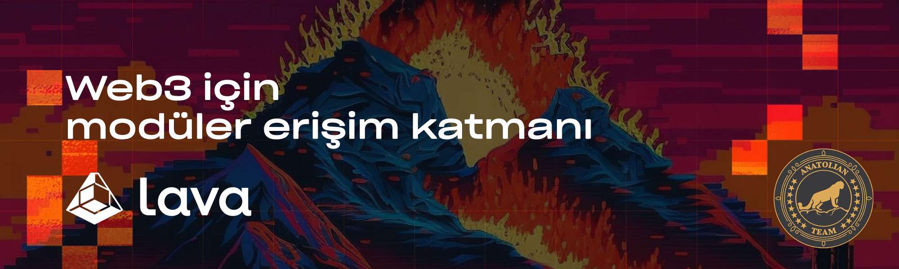

# Lava Network



## Bağlantılar
 ✔️ [Website](https://www.lavanet.xyz) |
 ✔️ [Blockchain Explorer](https://cosmos-testnet.anatolianteam.com/LavaNetwork) |
 ✔️ [Doküman](https://docs.lavanet.xyz/) |
 ✔️ [GitHub](https://github.com/lavanet) |
 ✔️ [Discord](https://discord.gg/zyvZ93yZpM)

## Gereksinimler

| Bşleşenler | Minimum | **Önerilen** |
| ------------ | ------------ | ------------ |
| CPU |	4 | 4 |
| RAM	| 8 GB | 16 GB |
| Storage	| 250 GB SSD | 500 GB SSD | 

## Ağ Bilgisi 

* Network Chain ID: lava-testnet-2
* Binary: lavad
* Denom: ulava
* Çalışma dizini: .lava

## Hizmetler
* **RPC:** https://rpc-t-lava.anatolianteam.com/ 
* **API:** https://api-t-lava.anatolianteam.com/
* **Explorer:** https://cosmos-testnet.anatolianteam.com/Lava%20Network

## Peering
Hızlı bağlantı ya da durum senkronizasyonu (statesync) için eş (peer) kullanabilirsiniz.
```shell
peers="COMING SOON"
sed -i.bak -e "s/^persistent_peers *=.*/persistent_peers = \"$peers\"/" $HOME/.lava/config/config.toml
```
Adres defteri üç saatte bir güncellenir. Hızlı başlatma için kullanabilirsiniz.
```shell
wget -O $HOME/.lava/config/addrbook.json "https://testnet.anatolianteam.com/lava/addrbook.json"
```

```mdx-code-block
import DocCardList from '@theme/DocCardList';

<DocCardList />
```
