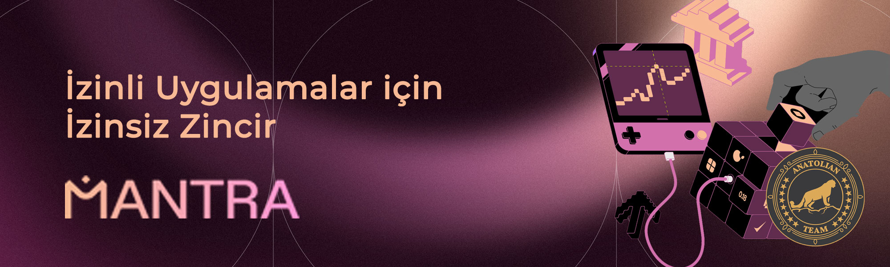

# Mantra Chain



## Bağlantılar
 ✔️ [Website](https://www.mantrachain.io/) |
 ✔️ [Blockchain Explorer](https://cosmos-testnet.anatolianteam.com/Mantra) |
 ✔️ [Doküman](https://docs.mantrachain.io/) |
 ✔️ [Discord](https://discord.gg/nthADXJHKM)

## Gereksinimler

| Bileşenler| Minimum | **Önerilen** |
| ------------ | ------------ | ------------ |
| CPU |	4 | 4 |
| RAM	| 8 GB | 16 GB |
| Disk	| 250 GB SSD | 500 GB SSD |

## Ağ Bilgisi 

* Network Chain ID: bbn-test-2
* Binary: mantrachaind
* Denom: uaum
* Working directory: .mantrachain

## Hizmetler
* **RPC:** https://rpc-t-mantra.anatolianteam.com/
* **API:** https://api-t-mantra.anatolianteam.com/
* **Explorer:** https://cosmos-testnet.anatolianteam.com/Mantra%20Chain

## Peering
Hızlı bağlantı ya da durum senkronizasyonu (statesync) için eş (peer) kullanabilirsiniz.
```shell
peers="fc0a973bd9c9da2b3a9f2aebb2efa9f14c25e8a5@86.48.0.190:12656"
sed -i.bak -e "s/^persistent_peers *=.*/persistent_peers = \"$peers\"/" $HOME/.mantrachaind/config/config.toml
```
Adres defteri üç saatte bir güncellenir. Hızlı başlatma için kullanabilirsiniz.
```shell
wget -O $HOME/.mantrachaind/config/addrbook.json "https://testnet.anatolianteam.com/mantra/addrbook.json"
```

```mdx-code-block
import DocCardList from '@theme/DocCardList';

<DocCardList />
```
