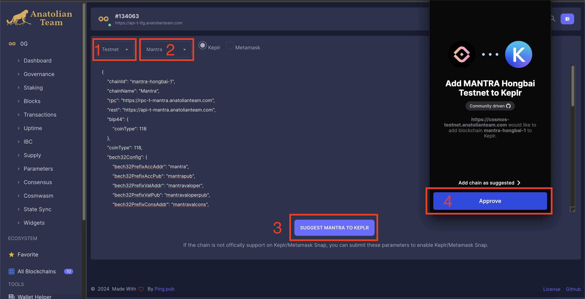
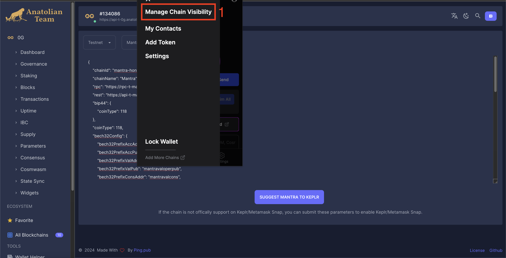

# Kullanıcı Rehberi

## Mantra Hongbai Ağı
[Keplr](https://chains.keplr.app) ya da Anatolian [explorer](https://cosmos-testnet.anatolianteam.com/wallet/suggest)'a gidip Hongbai ağını cüzdanınıza ekleyebilirsiniz.

### Anatolian Explorer'dan Ağı Ekleme

#### Ağı Ekleme

#### Ağı Akltive Etme

## Musluk

[Musluk](https://faucet.hongbai.mantrachain.io/)'a gidip OM token alın.

## Delege Etme

Bizim validatorümüzün [sayfasına](https://cosmos-testnet.anatolianteam.com/Mantra/staking/mantravaloper10h68k03qdtq67nlqp30tg77uhfrfjmcgqzu7js) giderek aldığınız 0.5 OM tokenin, 0.49'unu bize delege edebilirsiniz. 

