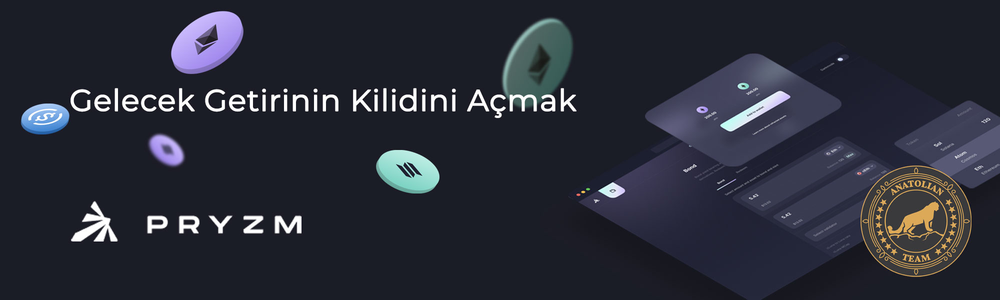

# Pryzm Zone



## Links

 ✔️ [Website](https://pryzm.zone/) | ✔️ [Explorer](https://cosmos-testnet.anatolianteam.com/Pryzm) | ✔️ [Doc](https://docs.pryzm.zone/) | ✔️ [GitHub](https://github.com/pryzm-finance) | ✔️ [Discord](https://discord.gg/eZGaXFEeEZ) | ✔️ [Zealy](https://zealy.io/c/pryzm/invite/cfNmFH3eoXrvl2Rr9qk7o)

## Gereksinimler

| Components | Minimum | **Recommended** |
| ------------ | ------------ | ------------ |
| CPU |	4 | 4 |
| RAM	| 16 GB | 16 GB |
| Storage	| 120 GB SSD | 250 GB SSD |

## Ağ Bilgisi 

* Network Chain ID: indigo-1
* Binary: pryzmd
* Denom: upryzm
* Working directory: .pryzm

## Hizmetler
* **RPC:** https://rpc-t-pryzm.anatolianteam.com/
* **API:** https://api-t-pryzm.anatolianteam.com/
* **Explorer:** https://cosmos-testnet.anatolianteam.com/Pryzm

## Peering
Hızlı bağlantı ya da durum senkronizasyonu (statesync) için eş (peer) kullanabilirsiniz.
```shell
peers=""
sed -i.bak -e "s/^persistent_peers *=.*/persistent_peers = \"$peers\"/" $HOME/.pryzm/config/config.toml
```
Adres defteri üç saatte bir güncellenir. Hızlı başlatma için kullanabilirsiniz.
```shell
wget -O $HOME/.pryzm/config/addrbook.json "https://testnet.anatolianteam.com/pryzm/addrbook.json"
```

```mdx-code-block
import DocCardList from '@theme/DocCardList';

<DocCardList />
```