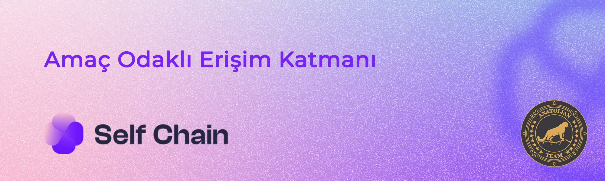

# Self Chain



## Bağlantılar
 ✔️ [Website](https://artela.network/) |
 ✔️ [Blockchain Explorer](https://cosmos-testnet.anatolianteam.com/Artela) |
 ✔️ [Doküman](https://docs.artela.network/main) |
 ✔️ [GitHub](https://github.com/artela-network) |
 ✔️ [Discord](https://discord.gg/artela)

## Gereksinimler

| Bşleşenler | Minimum | **Önerilen** |
| ------------ | ------------ | ------------ |
| CPU |	4 | 4 |
| RAM	| 8 GB | 16 GB |
| Storage	| 250 GB SSD | 500 GB SSD | 

## Ağ Bilgisi 

* Network Chain ID: artela_11822-1
* Binary: selfchaind
* Denom: uself
* Çalışma dizini: .selfchain

## Hizmetler
* **RPC:** https://rpc-t-selfchain.anatolianteam.com/ 
* **API:** https://api-t-selfchain.anatolianteam.com/
* **Explorer:** https://cosmos-testnet.anatolianteam.com/Artela

## Peering
Hızlı bağlantı ya da durum senkronizasyonu (statesync) için eş (peer) kullanabilirsiniz.
```shell
peers="COMING SOON"
sed -i.bak -e "s/^persistent_peers *=.*/persistent_peers = \"$peers\"/" $HOME/.selfchain/config/config.toml
```
Adres defteri üç saatte bir güncellenir. Hızlı başlatma için kullanabilirsiniz.
```shell
wget -O $HOME/.selfchain/config/addrbook.json "https://testnet.anatolianteam.com/selfchain/addrbook.json"
```

```mdx-code-block
import DocCardList from '@theme/DocCardList';

<DocCardList />
```
