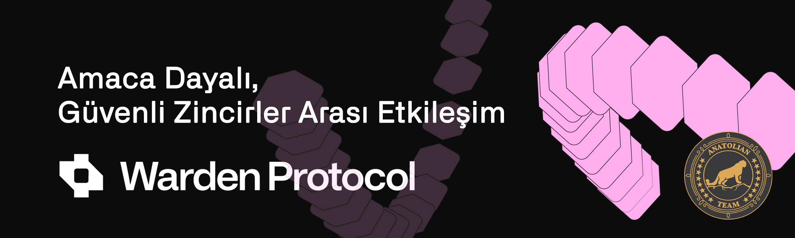

# Warden Protocol



## Bağlantılar
 ✔️ [Website](hhttps://wardenprotocol.org/) |
 ✔️ [Blockchain Explorer](https://cosmos-testnet.anatolianteam.com/Warden) |
 ✔️ [Doküman](hhttps://docs.wardenprotocol.org/) |
 ✔️ [GitHub](https://github.com/warden-protocol) |
 ✔️ [Discord](https://discord.gg/wardenprotocol)

## Gereksinimler

| Bşleşenler | Minimum | **Önerilen** |
| ------------ | ------------ | ------------ |
| CPU |	4 | 4 |
| RAM	| 8 GB | 16 GB |
| Storage	| 250 GB SSD | 500 GB SSD | 

## Ağ Bilgisi 

* Network Chain ID: alfama
* Binary: wardend
* Denom: uward
* Çalışma dizini: .warden

## Hizmetler
* **RPC:** https://rpc-t-warden.anatolianteam.com/ 
* **API:** https://api-t-warden.anatolianteam.com/
* **Explorer:** https://cosmos-testnet.anatolianteam.com/Warden

## Peering
Hızlı bağlantı ya da durum senkronizasyonu (statesync) için eş (peer) kullanabilirsiniz.
```shell
PEERS="6a8de92a3bb422c10f764fe8b0ab32e1e334d0bd@sentry-1.alfama.wardenprotocol.org:26656,7560460b016ee0867cae5642adace5d011c6c0ae@sentry-2.alfama.wardenprotocol.org:26656,24ad598e2f3fc82630554d98418d26cc3edf28b9@sentry-3.alfama.wardenprotocol.org:26656"
sed -i.bak -e "s/^persistent_peers *=.*/persistent_peers = \"$PEERS\"/" $HOME/.warden/config/config.toml
```
Adres defteri üç saatte bir güncellenir. Hızlı başlatma için kullanabilirsiniz.
```shell
wget -O $HOME/.warden/config/addrbook.json "https://testnet.anatolianteam.com/warden/addrbook.json"
```

```mdx-code-block
import DocCardList from '@theme/DocCardList';

<DocCardList />
```
