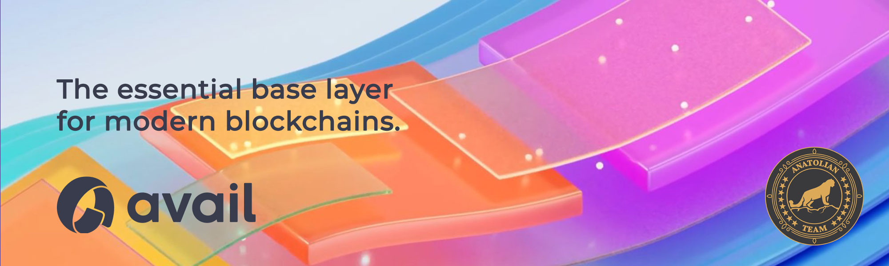

# Avail Project



## Links

 ✔️ [Website](https://availproject.org/) | ✔️ [Explorer](https://goldberg.avail.tools/) | ✔️ [Doc](https://docs.availproject.org) | ✔️ [GitHub](https://github.com/availproject) | ✔️ [Blog](https://blog.availproject.org/) | ✔️ [Discord](https://discord.gg/BDARnX7dMJ)

## Requirements

| Components | Minimum | **Recommended** |
| ------------ | ------------ | ------------ |
| CPU |	2 | 4 |
| RAM	| 4 GB | 8 GB |
| Storage	| 20-40 GB SSD | 200-300 GB SSD |

## Network Info 

* Network Chain ID: goldberg
* Binary: avail
* Denom: AVL
* Working directory: avail / avail-light / avail-light-relay / avail-light-bootstrap

## Public Services
* **RPC:** 
* **API:** 
* **Explorer:** https://goldberg.avail.tools


```mdx-code-block
import DocCardList from '@theme/DocCardList';

<DocCardList />
```
