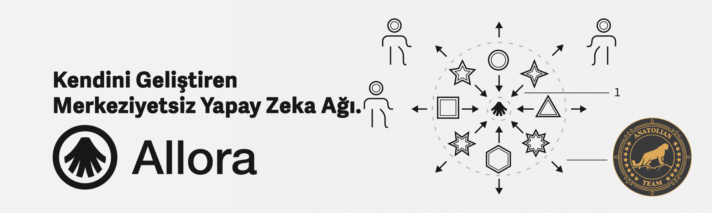

# Allora 



## Bağlantılar
 ✔️ [Website](https://www.allora.network/) |
 ✔️ [Doküman](https://docs.allora.network/) |
 ✔️ [GitHub](https://github.com/allora-network) |
 ✔️ [Discord](https://discord.gg/2NqGYRxPHQ)


## Worker Gereksinimler

| Bileşenler | Minimum | **Önerilen** |
| ------------ | ------------ | ------------ |
| CPU |	2 | 4 |
| RAM	| 2 GB | 4 GB |
| Storage | 5 GB SSD | 10 GB SSD |
 
| Mimari | Docker | Go |
| ------------ | ------------ | ------------ | 
| Linux, Windows, macOS | 20.04 ve üzeri | 1.21 ve üzeri  |

```mdx-code-block
import DocCardList from '@theme/DocCardList';

<DocCardList />
```
