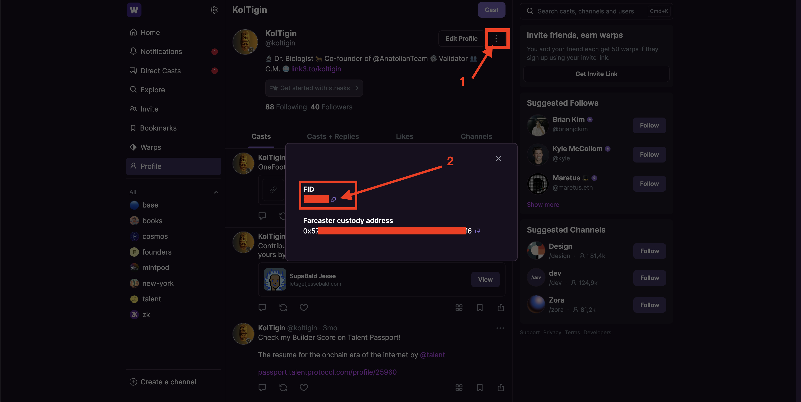
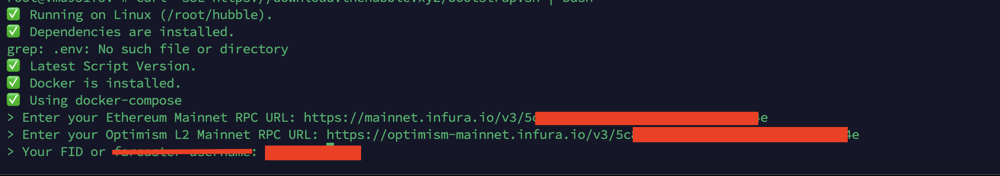

# Farcaster Hubble Kurulum Rehberi 

## Gereklilikler
1. Warpcast kullanıcı id'nizi (FID), Warpcast hesabınız yoksa [buradan](https://warpcast.com/~/invite-page/328172?id=bfbf46c5) 5-6 dolar maliyetle bir hesap açabilirsiniz.
2. Hubble 2281, 2282, 2283 ve 3000 (grafana) portlarını kullanacaktır. Sisteminizde bu portların kullanılmadığından emin olun.
3. Ethereum ve Optimism RPC, [Alchemy](https://dashboard.alchemy.com/) ya da [Infura](https://app.infura.io/)'dan bunları temin edebilirsiniz. 

> Warpcast FID Nerede?



## Sistemi Güncelleme
```shell
apt update && apt upgrade -y
```

## Gerekli Kütüphanelerin Kurulması
```shell
apt install ca-certificates gnupg lsb-release make git curl screen -y < "/dev/null"
```

## Docker Kurulumu
```shell
curl -fsSL https://download.docker.com/linux/ubuntu/gpg | sudo gpg --dearmor -o /usr/share/keyrings/docker-archive-keyring.gpg
echo "deb [arch=$(dpkg --print-architecture) signed-by=/usr/share/keyrings/docker-archive-keyring.gpg] https://download.docker.com/linux/ubuntu $(lsb_release -cs) stable" | sudo tee /etc/apt/sources.list.d/docker.list > /dev/null
apt-get update
apt-get install docker-ce docker-ce-cli containerd.io
docker version
```

## Docker Compose Kurulumu
```shell
curl -L "https://github.com/docker/compose/releases/download/1.29.2/docker-compose-$(uname -s)-$(uname -m)" -o /usr/local/bin/docker-compose
chmod +x /usr/local/bin/docker-compose
```

## Script ile Kurulum
Aşağıdaki kodu çalıştırdığınızda sizden `Ethereum` ve `Optimism RPC` ile birlikte `Warpcast FID` isteyecek. 




```shell
curl -sSL https://download.thehubble.xyz/bootstrap.sh | bash
```

### Log Kontrol Etme
```shell
cd $HOME/hubble 
./hubble.sh logs
```

### Hubble'ı Durdurma
```shell
cd $HOME/hubble 
./hubble.sh down
```

### Hubble'ı Başlatma
```shell
cd $HOME/hubble 
./hubble.sh up
```

### Hubble Veritabanını Sıfırlama
```shell
cd $HOME/hubble 
rm -rf .rocks
```

### FID Kontrol Etme
Senkronize olduktan sonra aşağıdaki kod ile Warpcast FID doğrumu kontrol edin.
```shell
docker logs hubble-hubble-1 2>&1 | grep "Hub Operator FID"
```

### Güncelleme
```shell
cd $HOME/hubble && ./hubble.sh upgrade
```

## Docker ile Elle Kurulum

### Repoyu Klonlama
```shell
git clone -c advice.detachedHead=false -b @latest https://github.com/farcasterxyz/hub-monorepo.git
```

### Anahtar Çifti Oluşturma
```shell
cd $HOME/hub-monorepo/apps/hubble
chmod -R 777 $HOME/hub-monorepo/apps/hubble/.hub
chmod -R 777 $HOME/hub-monorepo/apps/hubble/.rocks
```

```shell
docker compose run hubble yarn identity create
```

### .env Dosyası Oluşturma
Aşağıdaki kodda `ETH_MAINNET_RPC_URL`, `OPTIMISM_L2_RPC_URL` ve `OPTIMISM_L2_RPC_URL` bölümlerini kendi bilgilerinize doldurup çalıştırın.
```shell
tee $HOME/hub-monorepo/apps/hubble/.env > /dev/null << EOF
ETH_MAINNET_RPC_URL=https://mainnet.infura.io/v3/XXXXXXXXXXXXXXXXXXXXXXXXXXXX # Replace your Alchemy / Infura ETH Mainnet RPC
OPTIMISM_L2_RPC_URL=https://optimism-mainnet.infura.io/v3/XXXXXXXXXXXXXXXXXXXXXXXXXXXX # Replace your Alchemy / Infura Optimism Mainnet RPC
OPTIMISM_L2_RPC_URL=Warpcast_FID # Replace your FID
FC_NETWORK_ID=1
BOOTSTRAP_NODE=/dns/nemes.farcaster.xyz/tcp/2282
STATSD_METRICS_SERVER=statsd:8125
EOF
```

### Hubble Çalıştırma
```shell
cd $HOME/hub-monorepo/apps/hubble
docker compose up hubble -d
```

### Log Kontrol Etme
Çalıştırdıktan sonra aşağıdaki kod ile senktronizasyonu kontrol edin. Biraz uzun sürecektir.
```shell
cd $HOME/hub-monorepo/apps/hubble
docker compose logs -f hubble
```

### FID Kontrol Etme
Senkronize olduktan sonra aşağıdaki kod ile Warpcast FID doğru mu kontrol edin.
```shell
cd $HOME/hub-monorepo/apps/hubble
docker logs hubble-hubble-1 2>&1 | grep "Hub Operator FID"
```

### Güncelleme
```shell
cd $HOME/hub-monorepo/apps/hubble
git fetch --tags --force && git checkout @latest
docker compose stop && docker compose up -d --force-recreate --pull always
```

## Grafana Monitör Ayarları (El ile kurulum için)
Burada 3000 portunu kullanan sunucularda Grafana yapılandırılması anlatılmıştır.

### Grafana Port Değiştirme
Varsayılan olarak 3000 olan portu değiştirmek için aşağıdaki kodda müsait portunuzu yazın ve kodu çalıştırın.
```shell
GRAFANA_PORT=3005
```
Ardından aşağıdaki kodu çalıştırın.
```shell
sed -i.bak -e "s%:3000%:${GRAFANA_PORT}%g" $HOME//hub-monorepo/apps/hubble/docker-compose.yml
sed -i.bak -e "s%3000:3000%:${GRAFANA_PORT}:${GRAFANA_PORT}%g" $HOME//hub-monorepo/apps/hubble/docker-compose.yml
```
### Grafana Klasör Oluşturma ve İzinleri Verme
```shell
cd $HOME
mkdir -p /var/lib/grafana/plugins/
chmod -R 777 /var/lib/grafana/
chmod -R 777 /var/lib/grafana/plugins/
```

### Grafana Çalıştırma
```shell
cd $HOME/hub-monorepo/apps/hubble
docker compose up statsd grafana -d
```

### Grafana Panele Erişim

`IP_ADRESI:30XX` adresine gidin kullanıcı adı ve parola olarak `admin` ile giriş yapın.

## Hubble Durumunu Kontrol Etme
Aşağıdaki kodun çıksıtı `false` olmalı.
```shell
curl http://127.0.0.1:2281/v1/info?dbstats=1 | jq
```