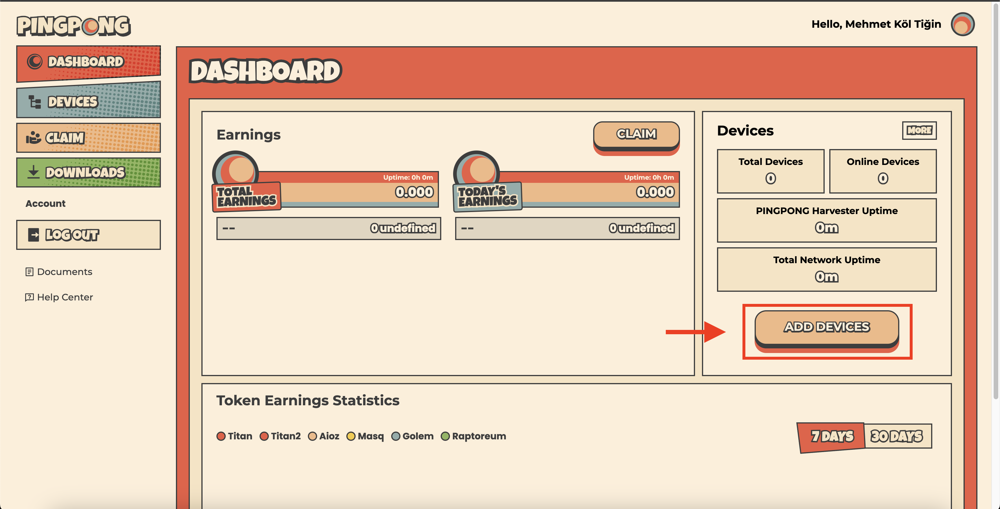
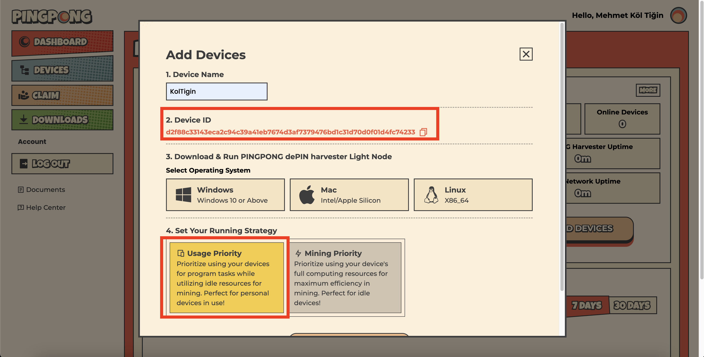

# Pingpong Kurulum 

Burada Ubuntu kurulumu anlatılmıştır. 

:::warning
Kurulum yapacağınız sunucu 22.04 olmalıdır. 
:::

**Başlamadan önce yapılacaklar:**
1. [Harvester](https://harvester.pingpong.build/) sayfasına google hesabınızla bağlanıp bir hesap oluşturun.
2. Aşağıdaki resimde gördüğünüz `Add Devices` butonuna tıklayın.

3. Açılan pencerede aşağıdaki resimge gördüğünüz gibi `cihaz adınızı` yazıp `ID`'nizi alın. `Bu ID son aşamada lazım olacak.`

4. `Linux` seçin ve ardından sonra `Let's Gooo!` butonuna tıklayın.

## Sistemi Güncelleme
```shell
apt update && apt upgrade -y
```

## Gerekli Kütüphanelerin Kurulması
```shell
apt install wget screen -y < "/dev/null"
```

## Docker Kurulumu
```shell
curl -fsSL https://download.docker.com/linux/ubuntu/gpg | sudo gpg --dearmor -o /usr/share/keyrings/docker-archive-keyring.gpg
echo "deb [arch=$(dpkg --print-architecture) signed-by=/usr/share/keyrings/docker-archive-keyring.gpg] https://download.docker.com/linux/ubuntu $(lsb_release -cs) stable" | sudo tee /etc/apt/sources.list.d/docker.list > /dev/null
apt-get update
apt-get install docker-ce docker-ce-cli containerd.io
docker version
```

## Pingpong İndirme
```shell
wget https://pingpong-build.s3.ap-southeast-1.amazonaws.com/linux/latest/PINGPONG
```
> Alternatif:
```shell
wget https://anatolianteam.com/PINGPONG
```

## Pingpong Çalıştırma
Bir screen açın.

```shell
screen -S ping
```

`ID` yazan yere panelde size verilen DI'ui yazınız.
```shell
chmod +x ./PINGPONG && ./PINGPONG --key ID
```

## Diğer Görevler

[Uygulama](https://app.pingpong.build/points?invite_code=FvjWneYQ) sayfasına gidip cüzdan ve twitter bağlayarak görevleri yapabilirsiniz. 

Ek olarak panelde cüzdan ile Holešky ağında tokenlerinizi talep edip görevleri yaparak puan toplayabilirsiniz. 


